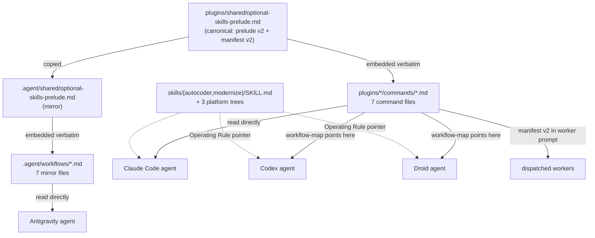

# feat: Prefer compound-engineering skills across all four agent platforms

## Goal Capsule

Add a **compound-engineering (CE) precedence tier** to the opportunistic optional-skills
integration, so that when the CE plugin is installed its `ce-*` skills are used in place of
the `superpowers:*` and personal-toolkit skills named in the command mapping tables — on
all four agent platforms this repo supports (Claude Code, Codex, Factory Droid, Antigravity).

When CE is not installed, behavior is byte-for-byte what it is today.

---

## Problem Frame

The integration currently degrades across two tiers: fully-qualified plugin skills
(`superpowers:*`, `autocoder:*`) and bare-name personal toolkit skills
(`thorough-brainstorming`, `critical-design-review`, `completion-review`, …). The CE plugin
covers many of the same roles and ships to exactly the four platforms this repo targets, but
nothing in the protocol tells an agent to prefer it. Expressing that preference inside each
of the seven mapping tables would duplicate the rule fourteen times; expressing it once in
the shared prelude reaches every command through machinery that already exists and is already
drift-guarded.

---

## Requirements

| ID | Requirement |
|---|---|
| R1 | When a CE skill covering a mapped role is available, it is invoked in place of the `superpowers:*` or bare-name skill for that role. |
| R2 | CE outranks both other tiers. Order: `compound-engineering:*` > `superpowers:*` / personal toolkit > inline protocol. |
| R3 | CE names match in **either** form: fully-qualified `compound-engineering:ce-<name>` (Claude Code) or bare `ce-<name>` (Codex, Droid, Antigravity). |
| R4 | Worktree provisioning and branch finishing are **not** substituted — the inline protocol keeps ownership of worktree naming, the issue-claim sequence, and the configured Merge Mode. |
| R5 | A role covered by an installed CE substitute does not count as a missing `superpowers:*` skill for the entry-time recommendation line. No install notice is ever emitted for CE. |
| R6 | Dispatched workers (`/fix-loop`, `/modernize`), which receive only the manifest block and not the prelude, also learn the CE preference. |
| R7 | With CE absent, every command behaves exactly as it does today. |
| R8 | All four supported platforms are covered: Claude Code (`plugins/`), Antigravity (`.agent/`), Codex (`codex-plugins/`), Factory Droid (`.factory/`). |
| R9 | `scripts/check-optional-skills-drift.sh` and `tests/test_skill_packaging.sh` pass after the change. |

### Roles substituted (the precedence table)

| Role | CE skill | In place of |
|---|---|---|
| design exploration / requirements | `ce-brainstorm` | `thorough-brainstorming`, `superpowers:brainstorming` |
| implementation planning | `ce-plan` | `thorough-writing-plans`, `superpowers:writing-plans` |
| executing a plan | `ce-work` | `superpowers:executing-plans` |
| debugging a defect | `ce-debug` | `superpowers:systematic-debugging` |
| reviewing a spec or plan document | `ce-doc-review` | `critical-design-review`, `critical-implementation-review`, `update-design-doc`, `update-implementation-plan` |
| reviewing written code | `ce-code-review` | `completion-review`, `superpowers:requesting-code-review` |
| acting on review feedback | `ce-resolve-pr-feedback` | `superpowers:receiving-code-review` |
| session handoff | `ce-handoff` | `create-handoff`, `resume-handoff` |

Not substituted, unchanged: `superpowers:test-driven-development`,
`superpowers:subagent-driven-development`, `superpowers:dispatching-parallel-agents`,
`superpowers:verification-before-completion`, `superpowers:using-git-worktrees`,
`superpowers:finishing-a-development-branch`, `autocoder:improve-test-coverage`,
`arch-review`, `security-review`.

---

## Key Technical Decisions

**KTD1 — Precedence lives in the shared prelude, not in the mapping tables.**
*(session-settled: user-directed — chosen over per-table inline preference: one rule to
maintain instead of fourteen; the mapping tables stay readable and the existing drift script
already guards the prelude.)* Mapping tables are untouched except where CE adds a name the
precedence table cannot supply.

**KTD2 — Match both the qualified and bare CE name forms.** CE skills are named `ce-*` on
every platform; only Claude Code prefixes them with `compound-engineering:`. Matching only
the qualified form would make the whole table dead text on three of the four platforms. The
`ce-` prefix keeps bare matching unambiguous against the repo's other bare-name skills.

**KTD3 — Worktree and branch-finish roles are excluded.** *(session-settled: user-approved —
chosen over full substitution: `ce-worktree` would compete with `/fix-loop`'s `main-wt-N`
naming and the working-label → branch → comment claim sequence, and `ce-commit-push-pr`
always opens a PR, which contradicts a repo configured with `Merge Mode: merge`.)*

**KTD4 — Make the drift script version-agnostic rather than bumping all seven mapping
sentinels.** *(session-settled: user-directed — chosen over a uniform v1→v2 bump.)* Pass 2
currently interpolates a literal `v1` into its `awk` range. If a mapping block bumps to `v2`,
`awk` extracts nothing from **both** mirrors, the two empty strings hash equal, and the
script prints `OK` while verifying nothing — a silent false pass. Matching `v[0-9]+` and
failing on an empty extraction fixes that class of bug permanently and removes the script
edit from every future sentinel bump.

**KTD5 — Only the `plugins/` skill mirror is byte-identical; Codex and Droid get
platform-worded equivalents.** Verified, contradicting the origin spec: `.factory/` copies
substitute "Droid" for "Codex" in two places, and both `codex-plugins/` and `.factory/` drop
the `model-config.md` reference line. `tests/test_skill_packaging.sh` enforces byte-identity
for the `plugins/` column only. Copying root over the Codex/Droid trees would silently revert
their adaptations.

---

## High-Level Technical Design

How the CE rule reaches an agent on each platform:

Codex and Droid inherit the prelude through `references/workflow-map.md`, which names
`plugins/autocoder/commands/fix.md` as the primary protocol — so no new prelude copies are
needed in those trees. The `SKILL.md` Operating Rule is a redundant pointer for agents that
read `SKILL.md` first and might not reach the prelude section.

---

## Implementation Units

### U1. Add CE precedence to the canonical prelude (v1 → v2)

**Goal:** The authoritative boilerplate carries the precedence rule and the role table.

**Requirements:** R1, R2, R3, R4, R5

**Dependencies:** none

**Files:**
- `plugins/shared/optional-skills-prelude.md` (modify)

**Approach:**
1. Inside the `optional-skills-prelude` sentinels, bump both sentinel comments `v1` → `v2`.
2. Add the **Compound Engineering precedence** paragraph, the dual-name-form sentence, and
   the role table (from Requirements above), plus the explicit non-substitution note for
   worktree/branch-finish.
3. Extend **Skill-name matching** to name the third tier and both CE name forms.
4. Extend the platform line — today naming only Gemini CLI / Antigravity `activate_skill` —
   to also name Codex (`$<skill>`) and Factory Droid.
5. In **Failure semantics**, change only the notice sentence per R5. Leave the rest of that
   paragraph and the whole **Version trust** paragraph byte-unchanged.
6. In the manifest block below the boilerplate, bump `optional-skills-manifest` `v1` → `v2`
   and add the one-sentence CE preference for workers (R6).
7. Update the file's own "bump `v1` → `v2` everywhere simultaneously" instruction so it
   reads `v2` → `v3` for the next editor.

**Patterns to follow:** existing paragraph style in the same file — bolded lead-in, one
rule per paragraph.

**Execution note:** The failure-semantics and version-trust paragraphs are load-bearing and
have been dropped by a previous refactor. Edit surgically; do not rewrite them.

**Test scenarios:**
- After U2, `scripts/check-optional-skills-drift.sh` Pass 1 reports one hash across all 16 files.
- The `Failure semantics` paragraph still contains the not-installed / mid-run / self-skip
  clauses, and the `Version trust` paragraph still exists.

**Verification:** The canonical file contains `optional-skills-prelude v2` sentinels, the
role table, and both preserved paragraphs.

---

### U2. Propagate the prelude to the `.agent` mirror and all 14 command files

**Goal:** Every embedding is byte-identical to the new canonical block.

**Requirements:** R1, R7, R8, R9

**Dependencies:** U1

**Files:**
- `.agent/shared/optional-skills-prelude.md` (modify)
- `plugins/autocoder/commands/{fix,fix-loop,retro,brainstorm-issue,approve-proposal}.md` (modify)
- `plugins/modernize/commands/{plan,modernize}.md` (modify)
- `.agent/workflows/{fix,fix-loop,retro,brainstorm-issue,approve-proposal,plan,modernize}.md` (modify)

**Approach:**
1. Copy the canonical file to `.agent/shared/optional-skills-prelude.md` (whole-file copy —
   they are maintained as identical files).
2. Extract the new block (BEGIN through END, inclusive) from the canonical file once.
3. For each of the 14 command files, replace the existing `v1` block — matched from its
   BEGIN sentinel through its END sentinel — with the extracted block. Regenerate rather
   than hand-editing each file, so no file can drift.
4. Leave every other line of the command files untouched in this unit.

**Patterns to follow:** the regeneration flow described in
`plugins/shared/optional-skills-prelude.md` — canonical file first, embeddings regenerated
from it.

**Test scenarios:**
- `bash scripts/check-optional-skills-drift.sh` Pass 1 prints `boilerplate: OK (one hash across all files)`.
- `grep -rc "optional-skills-prelude v1" plugins .agent` returns no matches.
- `git diff --stat` shows exactly 16 files touched across U1+U2, with no unrelated hunks.

**Verification:** Pass 1 of the drift script is green and no `v1` prelude sentinel survives.

---

### U3. Update the three mapping tables that need explicit CE names

**Goal:** Worker candidate lists and `/retro` name the CE skills the precedence table cannot
supply on its own.

**Requirements:** R6, and the `ce-compound` addition

**Dependencies:** U1 (manifest v2 wording), U4 (version-agnostic drift check must land
before or with this, or Pass 2 silently no-ops on the bumped sentinels)

**Files:**
- `plugins/autocoder/commands/fix-loop.md` (modify)
- `.agent/workflows/fix-loop.md` (modify)
- `plugins/modernize/commands/modernize.md` (modify)
- `.agent/workflows/modernize.md` (modify)
- `plugins/autocoder/commands/retro.md` (modify)
- `.agent/workflows/retro.md` (modify)

**Approach:**
1. `fix-loop`: append `ce-brainstorm`, `ce-plan`, `ce-work`, `ce-debug`, `ce-code-review`,
   `ce-doc-review`, `ce-resolve-pr-feedback` to the per-worker candidate set in the **Worker
   dispatch** paragraph.
2. `modernize`: append the same names to the code-producing-worker candidate set in its
   **Worker dispatch** paragraph.
3. `retro`: add a mapping row — capture durable learnings → `ce-compound` — as an additive
   entry alongside the existing `completion-review` row.
4. Bump each of these three mapping sentinels `v1` → `v2` (BEGIN and END).
5. Apply each edit identically to both mirrors. CE names are written bare; the prelude states
   both forms match.
6. Leave the `fix`, `plan`, `brainstorm-issue`, and `approve-proposal` mapping blocks
   untouched, including their `v1` sentinels.

**Test scenarios:**
- Drift script Pass 2 prints `OK` for all seven commands, including the four still at `v1`
  and the three now at `v2`.
- Deliberately perturbing one character in `.agent/workflows/retro.md`'s mapping block makes
  Pass 2 print `retro: DRIFT` and exit non-zero (proves the mixed-version matcher is live,
  not vacuously passing).

**Verification:** Both mirrors of each edited command hash equal; the four untouched commands
still hash equal at `v1`.

---

### U4. Make the drift script version-agnostic and fail loudly on an empty block

**Goal:** Close the silent-false-pass hole and stop requiring a script edit per sentinel bump.

**Requirements:** R9

**Dependencies:** none (land before or with U3)

**Files:**
- `scripts/check-optional-skills-drift.sh` (modify)

**Approach:**
1. Pass 1: change the `awk` range to match `optional-skills-prelude v[0-9]+` at both ends.
2. Pass 2: change the interpolated range to `optional-skills-mapping ${cmd} v[0-9]+`, and
   change the `grep -l` file-selection pattern to match any version too.
3. In both passes, capture the extracted block into a variable and **error out** when it is
   empty — an empty extraction currently hashes equal to another empty extraction and reports
   a false `OK`.
4. Update the header comment to describe the version-agnostic behavior.

**Patterns to follow:** the script's existing `echo "ERROR: …" >&2; exit 1` style for
structural problems, versus `drift_seen=1` for content drift. An empty block is structural.

**Execution note:** Prove the guard with a temporary edit before trusting it — the bug being
fixed is exactly a check that passes while verifying nothing.

**Test scenarios:**
- Baseline: script exits 0 on the current tree.
- Temporarily rename one file's mapping BEGIN sentinel to `v9`: the script must report an
  error or drift, not `OK`. Restore afterward.
- Temporarily delete a mapping block entirely: the script must exit non-zero with the
  empty-block error rather than printing `OK`.
- With genuine content drift between mirrors, Pass 2 still reports `DRIFT` and exits non-zero.

**Verification:** All four scenarios behave as described and the tree is restored.

---

### U5. Add the CE Operating Rule to the autocoder and modernize skills, across all trees

**Goal:** Agents that read `SKILL.md` first (Codex, Droid) see the CE preference without
having to reach the command protocol.

**Requirements:** R1, R8, R9

**Dependencies:** U1 (the rule points at the precedence table)

**Files:**
- `skills/autocoder/SKILL.md`, `skills/modernize/SKILL.md` (modify — source of truth)
- `plugins/autocoder/skills/autocoder/SKILL.md`, `plugins/modernize/skills/modernize/SKILL.md` (byte-identical copies)
- `codex-plugins/autocoder/skills/autocoder/SKILL.md`, `codex-plugins/modernize/skills/modernize/SKILL.md` (platform-adapted)
- `.factory/skills/autocoder/SKILL.md`, `.factory/skills/modernize/SKILL.md` (platform-adapted)
- `tests/test_skill_packaging.sh` (read only — no change expected)

**Approach:**
1. Add one bullet to the **Operating Rules** section of each root `SKILL.md`: if
   compound-engineering `ce-*` skills are available, prefer them over `superpowers:*` and
   bare-name toolkit skills per the precedence table in the command protocol.
2. Copy each root file over its `plugins/` counterpart — byte-identity there is enforced by
   `tests/test_skill_packaging.sh`.
3. For `codex-plugins/` and `.factory/`, **hand-apply the same bullet** rather than copying.
   These are platform-adapted variants: `.factory/` says "Droid" where root says "Codex" (two
   places in `autocoder`, one in `modernize`), and both Codex and Droid copies omit the
   `model-config.md` line from *When To Read More*. A blind copy would revert those.
4. Re-diff each adapted file after the edit to confirm the only remaining differences are the
   pre-existing, intentional ones.

**Execution note:** Verify the surviving diffs explicitly; this is the unit most likely to
silently clobber platform adaptations.

**Test scenarios:**
- `bash tests/test_skill_packaging.sh` passes (every root skill owned, packaged, and
  byte-identical in its `plugins/` mirror).
- `diff skills/autocoder/SKILL.md .factory/skills/autocoder/SKILL.md` shows exactly the three
  pre-existing differences and no others.
- `diff skills/autocoder/SKILL.md codex-plugins/autocoder/skills/autocoder/SKILL.md` shows
  exactly the one pre-existing difference.
- The new bullet is present in all eight files.

**Verification:** The rule appears in all eight `SKILL.md` files, the packaging test passes,
and no platform adaptation was lost.

---

### U6. Version bumps and full verification

**Goal:** The change is installable and the whole suite is green.

**Requirements:** R7, R9

**Dependencies:** U1–U5

**Files:**
- `.claude-plugin/marketplace.json` (modify)
- `CHANGELOG.md` (modify, if the repo convention has one for these plugins)

**Approach:**
1. Bump the `autocoder` and `modernize` entries under `plugins[]` and the root marketplace
   `version` — per `CLAUDE.md`, the root bump is what makes the update mechanism deliver the
   change.
2. Run the full verification set below.
3. Read back the CE-absent path: confirm no command's inline protocol changed, so a user
   without CE sees identical behavior (R7).

**Test scenarios:**
- `bash scripts/check-optional-skills-drift.sh` exits 0 with Pass 1 OK and all seven Pass 2
  commands OK.
- `bash tests/test_skill_packaging.sh` passes.
- `bash plugins/autocoder/scripts/regression-test.sh` passes.
- `for t in tests/test_*.sh; do bash "$t" || exit 1; done` passes.
- `bash -n plugins/autocoder/scripts/*.sh` and `python3 -m py_compile plugins/autocoder/scripts/*.py` succeed.
- `.claude-plugin/marketplace.json` parses as JSON and all three versions increased.

**Verification:** Every command above exits 0, with output captured rather than assumed.

---

## Verification Contract

| Gate | Command |
|---|---|
| Optional-skills drift | `bash scripts/check-optional-skills-drift.sh` |
| Skill packaging | `bash tests/test_skill_packaging.sh` |
| Regression suite | `bash plugins/autocoder/scripts/regression-test.sh` |
| Shell test suite | `for t in tests/test_*.sh; do bash "$t" || exit 1; done` |
| Syntax | `bash -n plugins/autocoder/scripts/*.sh && python3 -m py_compile plugins/autocoder/scripts/*.py` |

Note: `tests/test_*.py` require `pytest`, which is not installed in every environment. Run
them if available; report if skipped.

---

## Scope Boundaries

### In scope
The prelude precedence tier, the manifest sentence, three mapping-table edits, the drift
script fix, the `SKILL.md` Operating Rule across four trees, and version bumps.

### Deferred to Follow-Up Work
- Wiring `ce-simplify-code` into a post-implementation step of `/fix`.
- Wiring `ce-babysit-pr` into the PR-wait path of `/fix-loop` (a natural fit given
  `Merge Mode: pr`, but it changes loop control flow).
- Wiring `ce-test-browser`, `ce-optimize`, `ce-strategy`, `ce-ideate`, `ce-pov`.
- Revisiting `ce-worktree` / `ce-commit-push-pr` substitution if the inline worktree and
  merge-mode protocols are ever generalized.

### Non-goals
- Making any CE skill required or gating. Everything stays advisory under the existing
  "Skills are advisory, not gating" rule.
- Version pinning or capability detection beyond exact-name matching.
- Changing the inline protocols themselves.

---

## Risks

| Risk | Mitigation |
|---|---|
| A blind copy reverts Codex/Droid `SKILL.md` adaptations | U5 hand-applies and re-diffs; the expected surviving diffs are enumerated in its test scenarios |
| The drift script reports `OK` while checking nothing | U4 adds the empty-block guard and proves it with a deliberate perturbation |
| Prelude regeneration drops the failure-semantics or version-trust paragraphs | U1 edits surgically and asserts both paragraphs survive; U2 regenerates from the canonical file rather than editing 14 copies |
| Bare `ce-*` matching collides with an unrelated bare skill name | The `ce-` prefix is CE-specific; no existing repo-referenced skill uses it |
| Marketplace root version not bumped, so users never receive the update | U6 makes it an explicit step with a JSON-parse and version check |

---

## Open Questions

None blocking. Deferred to implementation: whether `CHANGELOG.md` needs an entry (check the
repo convention when U6 runs).

---

## Definition of Done

- The CE precedence rule and role table exist in the canonical prelude at `v2` and are
  byte-identical across all 16 files.
- The manifest block carries the worker CE sentence at `v2`.
- `fix-loop`, `modernize`, and `retro` mapping blocks name the CE skills and are identical
  across mirrors; the other four mapping blocks are untouched.
- `scripts/check-optional-skills-drift.sh` is version-agnostic, fails on an empty block, and
  exits 0 on the tree.
- All eight `SKILL.md` files carry the CE Operating Rule, with Codex/Droid adaptations intact.
- `autocoder`, `modernize`, and root marketplace versions are bumped.
- Every gate in the Verification Contract passes, with output shown.
- With CE absent, no command's behavior changes.

---

## Sources & Research

- Origin spec: `docs/superpowers/specs/2026-08-12-compound-engineering-skill-integration-design.md`
- CE plugin platform support and skill inventory: https://github.com/EveryInc/compound-engineering-plugin
- Repo integration machinery: `plugins/shared/optional-skills-prelude.md`,
  `scripts/check-optional-skills-drift.sh`, `tests/test_skill_packaging.sh`
- Packaging and version-bump rules: `CLAUDE.md` ("Skill Packaging", "Version Management")
