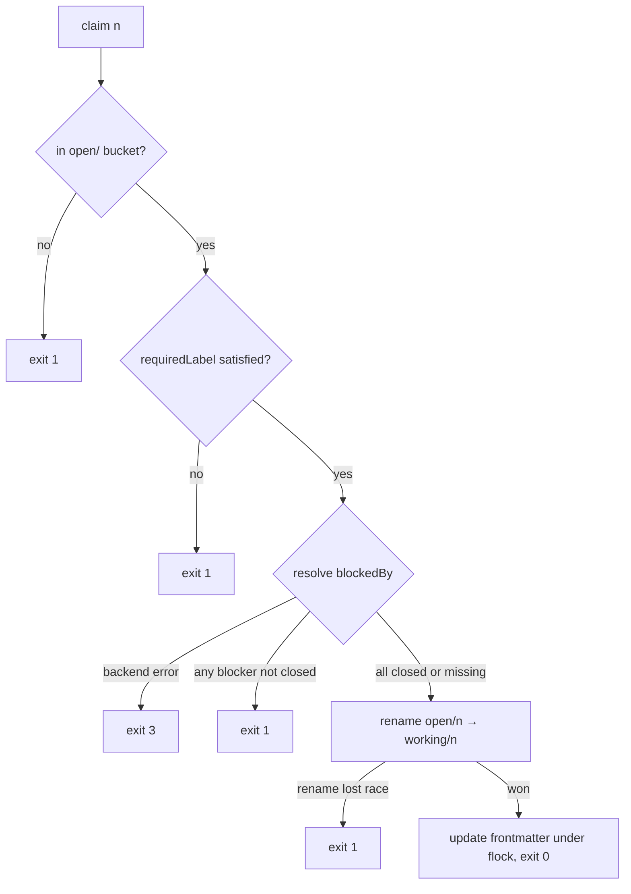

# Issue Dependency Edges (W1) - Plan

## Goal Capsule

- **Objective:** extend the pluggable issue-source contract from 9 verbs to 12 (`deps`, `block`, `unblock`), make claimability honor blocked-by edges, and update the consumers (`/list-issues --stuck`, `/show-issue`, `/brainstorm-issue` decomposition) — across all four backends, dependency-ordered so the file backend lands first.
- **Authority:** the origin spec (W1 section and its Verified Assumptions) is authoritative for behavior; this plan is authoritative for sequencing, files, and tests. Where they conflict, stop and surface it.
- **Stop conditions:** a backend API behaves differently than the spec's two flagged UNVERIFIED items assume (Jira link stubs lacking `fields.status`, ADO relation direction ambiguity beyond the two candidates) and no fallback in this plan covers it; or a change would alter the existing 9 verbs' documented exit-code behavior.
- **Execution profile:** normal code path — branch, implement in U-ID dependency order, test per unit, ship per repo Merge Mode (`pr`) in **two increments** (operator-decided, 2026-09-19, per the origin spec's file-first fast-follow sequencing): increment 1 = U1, U2, U3, U7 + U8's packaging/bump pass (file backend, contract doc, consumers); increment 2 = U4, U5, U6 + a second U8 pass, once the vendor-side implementation-time verifications resolve.
- **Tail ownership:** the executor owns the version bump, packager run, and the two follow-up issue filings in U8.

---

## Product Contract

### Summary

Add dependency edges to the issue-source contract: three new verbs across the file/GitHub/Jira/ADO backends, a claimability rule that an issue is claimable only when every blocker is closed, and consumer updates so agents pick work in dependency order and a manager can decompose an epic into claimable children.

### Problem Frame

The issue backends treat issues as a flat list. Agents cannot pick work in topological order, and a parent issue decomposed into subtasks has no mechanism to stay unclaimable until its children close. The origin spec (CDR-validated over two rounds) chose to capture the dependency-graph benefit inside the existing backend contract rather than adopting an external tracker.

### Requirements

**Contract**

- R1. Each backend implements three new verbs with the existing exit-code discipline: `deps <n>` prints `{"blockedBy": [{number, state}...], "blocks": [...]}`; `block <n> --on <m>` adds a blocked-by edge; `unblock <n> --on <m>` removes it (exit 1 if absent).
- R2. `block` is idempotent (re-adding an edge exits 0); a self-edge exits 1; a direct two-node cycle is rejected with exit 1. Longer cycles are not detected at write time (per KTD4).
- R3. `claim` refuses (exit 1) when any `blockedBy` issue is not closed; `any-claimable` does not count an issue with open blockers. A backend/API failure while resolving blockers exits 3 — an issue must never look unclaimable because a deps fetch failed.
- R4. A dangling edge (blocker not found) counts as satisfied for claimability; `deps` reports it with `"state": "missing"`.

**Storage**

- R5. File backend stores `blockedBy: [m, ...]` in the blocked issue's frontmatter; `blocks` is computed by scanning buckets.
- R6. GitHub backend uses the native dependency REST endpoints; when the API rejects (older GHES), it falls back to `blocked-by-<m>` labels, creating the label on demand.
- R7. Jira backend uses issue links of type "Blocks" (`is blocked by` inward); `get` gains `issuelinks` in its requested field list.
- R8. ADO backend uses `System.LinkTypes.Dependency` relations; reads use `$expand=relations`; `unblock` removes the relation by index via read-then-patch.

**Consumers**

- R9. `/list-issues` gains `--stuck`: reports open issues whose blockers are all open-and-blocked, plus issues carrying missing (dangling) edges.
- R10. `/show-issue` prints the deps block.
- R11. `/brainstorm-issue` decomposition creates child issues and blocks the parent on each; the parent becomes claimable exactly when all children close.

**Repo discipline**

- R12. `docs/issue-backends.md` is updated to the 12-verb contract in the same commit as the file-backend reference implementation.
- R13. Script mirrors are produced by `scripts/package-plugin-scripts.py` (write mode); command mirrors in `.agent/workflows/` are hand-applied with the cache-path adaptation; all plugin manifests bump together and `tests/test_manifest_versions.sh` passes.

### Key Decisions

- **Native links per backend; label convention only as GHES fallback** (session-settled: user-approved — chosen over convention-everywhere labels and body trailers: native links stay visible in each tracker's own dependency UI; body edits have no verb and clobber). Governs R6, R7, R8.
- **Claim-time-only blocker resolution; the blocker-reopens-after-claim race is accepted** (session-settled: user-approved via CDR round 1 — chosen over continuous re-validation: matches the contract's existing claim-race tolerance). Governs R3.
- **Dangling blocker = satisfied, surfaced not silent** (session-settled: user-approved via CDR round 1 — chosen over blocking forever on a deleted issue: deletion is an explicit human act; visibility comes from `"missing"` state and `--stuck`). Governs R4, R9.

### Scope Boundaries

- Workstreams W2–W6 of the origin spec are separate plans; nothing from them lands here.
- No new backend (`issues-beads.sh` interop remains future work per the spec's non-goals).
- No cross-backend edge migration; edges live in whichever backend is configured.
- No changes to `fix.md` or `gate.md` claim handling — claim exit 1 already means "pick another issue" (verified: `fix-loop-gate.sh` loops to the next candidate; `fix.md` treats claim failure as non-fatal).

#### Deferred to Follow-Up Work

- **`.agent/scripts/` divergence repair.** Research found `.agent/scripts/issue-fns.sh` is an old fat dispatcher missing `issue_claim`/`issue_release`/`issue_any_claimable` entirely, with a pre-bucket `issues-file.py` — CLAUDE.md's parity rule is already broken there, and that tree is not covered by the packager. Repairing it is unrelated scope; U8 files a follow-up issue documenting the drift instead (KTD3).
- **W5 batch-land design issue.** The origin spec assigns filing it to W1's cycle; U8 files it. No build.

---

## Planning Contract

### Key Technical Decisions

- KTD1. **`blockedBy` joins the file backend's serialization whitelist as the first edit.** `_format_issue()` serializes only a fixed key tuple; any other frontmatter key is silently dropped on every rewrite, so without this edit the first `comment` on a blocked issue erases its edges. Edge values normalize to a single representation on parse (frontmatter list elements arrive as strings; scalar ints elsewhere) so membership checks never miss on type — and the serializer's list rendering must coerce items to strings (`', '.join(str(v) for v in val)`), since the existing join assumes string elements and would raise on int-normalized lists.
- KTD2. **New file-backend verbs follow the existing concurrency pattern exactly:** `block`/`unblock` are fd-based read-modify-writes under `flock` (the `cmd_update` template); `deps` uses `resolve_path()`'s bounded bucket retry for snapshot reads; the claim-time blocker check runs before the `os.rename` race arbiter, in the same position as the existing requiredLabel gate. The rename-first atomicity barrier is not reordered.
- KTD3. **Script mirroring runs through `scripts/package-plugin-scripts.py` only; `.agent/scripts/` is left untouched.** The packager fans the plugin scripts out to the six machine-managed copies and `tests/test_script_packaging.sh` enforces them; `.agent/scripts/` is hand-maintained, already stale, and absorbing its repair here would swamp W1 (chosen over hand-syncing seven trees or repairing the drift in-plan; a follow-up issue records the drift).
- KTD4. **Cycle handling is shallow-by-design:** `block` rejects only the direct two-node cycle; longer cycles stay unclaimable as a group and surface through `--stuck` (session-settled: user-approved via the origin spec's CDR — chosen over graph traversal at write time: the contract has no cheap global-graph read, and the failure mode is visible, not silent). Governs the R2/R9 split of detection vs. surfacing.
- KTD5. **Exit-code mapping for the new surface:** exit 1 = clean negative (unblock of an absent edge, self-edge, two-node cycle, claim refused on an open blocker, issue not found); exit 3 = backend error (HTTP/auth/parse failure anywhere in edge resolution, including inside `claim` and `any-claimable`). This mirrors the reviewed history: the 0/1/3 split exists because "exit 1 = no work" once conflated transient backend errors with clean idle and made workers idle forever.
- KTD6. **New Jira/ADO verbs register in both dispatch points.** Each script has a verb whitelist `case` before `_require_config` and an execution `case` at the bottom; a verb added to only one exits 2 as unknown. Both scripts keep their inline `python3` heredoc JSON pattern with responses passed via env var, never stdin.
- KTD7. **The file-backend deps test is a shell suite** (`tests/test_issues_file_deps.sh`), not pytest — pytest is not installed in all environments (CLAUDE.md). It reuses the proven harness shape from `tests/test_issue_fns.sh`: temp git repo, `.autocoder.json` pointing at a temp `.issues/`, poisoned `gh` on PATH, local `pass/fail/assert_*` helpers, single `Results:` summary line.
- KTD8. **Remote-backend blocker filtering is per-candidate, bounded, and fail-loud — a cross-backend rule.** No remote query language expresses "all blockers closed" (GitHub search has no dependency qualifier; JQL and flat WIQL cannot filter on link state), so: `claim` resolves blockers from the issue's own read (gh dependencies / Jira `issuelinks` / ADO `$expand=relations`); `any-claimable` enumerates candidates from the existing open query with an explicit bound (first 50, matching `cmd_list`'s default limit), resolves blockers per candidate, exits 0 on the first unblocked candidate, exits 1 when no candidate within the bound is unblocked, and exits 3 on any resolution failure — a deps fetch error must never read as "no work". On the GitHub label fallback, blocker state still resolves per candidate before refusing. U4, U5, and U6 cite this rule instead of restating it.

### High-Level Technical Design

The claim predicate gains one stage. Order matters: the blocker check sits with the other pre-rename gates, and only the rename arbitrates the race.

Edge storage and resolution per backend:

| Backend | Edge write | Edge read for `deps`/`claim` | Blocker state source |
|---|---|---|---|
| file | `blockedBy:` list in frontmatter (fd+flock RMW) | parse frontmatter | bucket the blocker's file lives in |
| github | `POST/DELETE .../dependencies/blocked_by` (fallback: add/remove `blocked-by-<m>` label) | blockedBy: `GET .../dependencies/blocked_by`; blocks: `GET .../dependencies/blocking` (verify at implementation — the spec verified only blocked_by; fallback: blockedBy from own labels, blocks via `label:blocked-by-<n>` issue search) | per-blocker `gh issue view --json state` |
| jira | `POST /rest/api/2/issueLink` type Blocks / `DELETE /rest/api/2/issueLink/<id>` | `issuelinks` field on `get` | embedded linked-issue stub status (verify at implementation; fall back to per-blocker get) |
| ado | JSON-patch `add /relations/-` with work-item URL / `remove /relations/<index>` | `GET ...?$expand=relations` | per-blocker `get` of `System.State` |

### Assumptions

- The origin spec's Verified Assumptions section holds as written (vendor endpoints, current field lists, worker-loop mechanics); this plan does not re-verify them.
- Two items the spec flags UNVERIFIED become implementation-time verification steps, not plan-time facts: Jira linked-issue stubs embedding `fields.status` (U5), and the ADO `System.LinkTypes.Dependency-Forward` vs `-Reverse` direction for blocked-by (U6). Each unit names its fallback if the assumption fails.

---

## Implementation Units

### U1. File backend: edge storage and the three verbs

- **Goal:** `issues-file.py` stores `blockedBy` durably and implements `deps`/`block`/`unblock`.
- **Requirements:** R1, R2, R4 (deps reporting), R5.
- **Dependencies:** none.
- **Files:** `plugins/autocoder/scripts/issues-file.py`, `tests/test_issues_file_deps.sh` (new).
- **Approach:**
  1. Add `blockedBy` to `_format_issue()`'s serialization tuple before anything else (KTD1), normalize parsed edge values to ints, and coerce list items to strings in the serializer's join (per KTD1) so int-normalized lists round-trip.
  2. Add `cmd_deps` (snapshot read via `resolve_path()`; computes `blocks` by scanning all four buckets, same cost class as `cmd_list`), `cmd_block`, `cmd_unblock` (fd+flock read-modify-write per the `cmd_update` template, KTD2).
  3. `cmd_block` enforces idempotency, self-edge rejection, and the two-node cycle check (reads the target's `blockedBy` for the reverse edge).
  4. Register subparsers and dispatch entries in `main()`.
- **Patterns to follow:** `cmd_update` for locked RMW; `cmd_get`/`to_gh_json` for JSON output conventions; exit codes per the module docstring.
- **Test scenarios** (in `tests/test_issues_file_deps.sh`, harness per KTD7):
  - `block 2 --on 1` then `deps 2` shows blocker 1 with its live state; `deps 1` shows `blocks: [2]`.
  - Re-running the same `block` exits 0 and stores the edge once.
  - `block 2 --on 2` exits 1; after `block 2 --on 1`, `block 1 --on 2` exits 1 (two-node cycle).
  - `unblock 2 --on 1` exits 0 and removes the edge; repeating it exits 1.
  - `deps` on an edge whose blocker file was deleted reports `"state": "missing"`.
  - `comment` then `update --add-label x` on a blocked issue preserves `blockedBy` (the KTD1 regression).
  - `deps`/`block` on a nonexistent issue exit 1.
- **Verification:** new suite passes under `bash tests/run-shell-suite.sh`; existing pytest file-backend suites still pass where pytest exists.

### U2. File backend: claimability honors blockers

- **Goal:** `claim` and `any-claimable` refuse work whose blockers are not closed.
- **Requirements:** R3, R4.
- **Dependencies:** U1.
- **Files:** `plugins/autocoder/scripts/issues-file.py`, `tests/test_issues_file_deps.sh`.
- **Approach:** a shared blocker-resolution helper returns closed/open/missing per edge; `cmd_claim` calls it before the rename, positioned with the requiredLabel gate (KTD2); `cmd_any_claimable` drops its no-requiredLabel parse short-circuit (every candidate now parses — note the cost in a comment) and skips candidates with open blockers. Missing blockers count as satisfied (R4).
- **Test scenarios:**
  - Claim of an issue with an open blocker exits 1 and the file stays in `open/`.
  - Closing the blocker makes the same claim succeed.
  - Blocker in `working/` (not closed) still blocks.
  - Dangling blocker does not block the claim.
  - `any-claimable` exits 1 when the only open issue is blocked, 0 once its blocker closes.
  - Two open issues blocking each other: `any-claimable` exits 1 (cycle containment, KTD4).
- **Verification:** the existing parallel-claim stress behavior is unchanged (pytest suite where available); shell suite green.

### U3. Dispatch layer and contract documentation

- **Goal:** consumers can call the new verbs through `issue-fns.sh`, and the contract doc describes 12 verbs.
- **Requirements:** R1 (dispatch), R12.
- **Dependencies:** U1, U2 (lands in the same commit as U1 and U2 per R12).
- **Files:** `plugins/autocoder/scripts/issue-fns.sh`, `docs/issue-backends.md`.
- **Approach:** add `issue_deps`/`issue_block`/`issue_unblock` one-line dispatchers. In `docs/issue-backends.md`, update the verb-list block, the "Uniform exit codes" section (per-verb 1-vs-3 semantics from KTD5), each per-backend subsection's storage note, and "Adding a custom backend" (now 12 verbs). Sweep the "9-verb" phrasing only in the hand-swept targets: `plugins/`, `docs/issue-backends.md`, `docs/jira-setup.md`, `docs/ado-setup.md`, `CLAUDE.md`, `GEMINI.md` — the packager-managed mirror trees regenerate in U8, and `.agent/scripts/` (KTD3), historical docs, specs, plans, and critical reviews keep the phrase by design. While rewriting the GitHub subsection, correct its pre-existing misattribution of the `[autocoder-claim]` marker protocol (it lives in `fix.md`, not `issues-gh.sh`).
- **Test scenarios:** covered by U1's suite driving the verbs through `issue-fns.sh` (source the dispatcher in at least one test rather than calling the backend binary directly).
- **Verification:** `grep -rn "9-verb" plugins/ docs/issue-backends.md docs/jira-setup.md docs/ado-setup.md CLAUDE.md GEMINI.md` returns no hits (mirror trees are checked in U8 after the packager run); shell suite green.

### U4. GitHub backend

- **Goal:** native dependency endpoints with the GHES label fallback, and blocker-aware claimability.
- **Requirements:** R1–R4, R6.
- **Dependencies:** U3.
- **Files:** `plugins/autocoder/scripts/issues-gh.sh`, `tests/test_issues_gh_deps.sh` (new).
- **Approach:**
  1. `cmd_deps`/`cmd_block`/`cmd_unblock` via `gh api` against the `dependencies/blocked_by` endpoints; `deps` reads the `blocks` half from `GET .../dependencies/blocking` — a third implementation-time verification item (the spec verified only `blocked_by`; if `blocking` is absent, emit `blocks: []` with a documented note).
  2. **GHES fallback discrimination:** a dependencies-endpoint 404 also means "issue not found" — confirm the issue exists (`gh issue view <n>`, already needed for blocker state) before interpreting 404/410 as feature-unavailable; only then take the `blocked-by-<m>` label path (`gh label create ... || true` before add; a persisting permission failure surfaces as exit 3 from the label add). Cache the feature-unavailable determination per invocation so native and label writes never interleave. Fallback `blocks` reads use a `label:blocked-by-<n>` issue search.
  3. **R2 semantics enforce script-side** (never rely on vendor duplicate handling): `cmd_block` first runs the deps read for both endpoints, then enforces idempotent-re-add-exit-0, self-edge-exit-1, and reverse-edge (two-node cycle) exit-1 before issuing any write.
  4. `cmd_claim`/`cmd_any_claimable`: per-candidate, bounded, fail-loud blocker resolution per KTD8; blocker state via `gh issue view --json state`.
  5. Three new arms in the single dispatch `case`.
- **Patterns to follow:** existing `cmd_*` + `case` structure; the `-label:` per-label exclusion mechanics (never `no:label`) for any fallback-path search filtering.
- **Test scenarios** (stubbed `gh` binary recording args, modeled on the curl-stub approach):
  - `block` issues a POST to the blocked_by endpoint with the blocker's `issue_id`.
  - `unblock` issues the DELETE with the blocker id in the path.
  - `deps` output includes the `blocks` direction (native `blocking` endpoint; fallback via label search).
  - Fallback: when the stub rejects the dependencies endpoint for an issue that exists, `block` creates and adds `blocked-by-7`; `deps` parses it back. When the target issue does not exist, `block` exits 1 — not the label path.
  - Re-running the same `block` exits 0 without a second write; `block n --on n` exits 1; after `block 2 --on 1`, `block 1 --on 2` exits 1.
  - `claim` refuses (exit 1) when the stub reports an open blocker; succeeds when closed.
  - `any-claimable` with first candidate blocked and second claimable exits 0 (KTD8).
  - Stub returning HTTP failure on blocker resolution → `claim` exits 3, not 1 (KTD5).
- **Verification:** `bash -n` clean; new suite green. Contract note: the "second claim fails" style of strict assertion stays out — gh claim is documented best-effort.

### U5. Jira backend

- **Goal:** Blocks-type issue links back the three verbs; `get` carries `issuelinks`.
- **Requirements:** R1–R4, R7.
- **Dependencies:** U3.
- **Files:** `plugins/autocoder/scripts/issues-jira.sh`, `tests/test_issues_jira.sh`, `tests/test_issues_jira_integration.sh`, `tests/fixtures/fake_jira.py`.
- **Approach:**
  1. Add `issuelinks` to `cmd_get`'s field list; `cmd_deps` maps inward `is blocked by` links to `blockedBy`.
  2. `cmd_block` pre-reads both issues' links and enforces R2 script-side (idempotent-re-add exit 0, self-edge exit 1, reverse-edge exit 1) before posting `/rest/api/2/issueLink` (type Blocks); `cmd_unblock` finds the link id from the issue's links and DELETEs it (absent → exit 1). `cmd_claim`/`cmd_any_claimable` follow KTD8 (bounded per-candidate resolution, exit 3 on fetch failure).
  3. Register in both dispatch cases (KTD6); JSON via the env-var heredoc pattern.
  4. **Implementation-time verification (spec UNVERIFIED item):** confirm the linked-issue stub embeds `fields.status`; if it does not on the target instance, resolve blocker state with a per-blocker `get` instead.
  5. Extend `fake_jira.py` with issuelinks state (create/delete link, embed linked stubs with status) so the integration test can drive a full block → claim-refused → close-blocker → claim lifecycle.
- **Test scenarios:**
  - Curl-stub: `get` request names `issuelinks` in `fields=`; `block` posts the Blocks link JSON shape; `unblock` DELETEs the right link id.
  - Integration: block → claim exits 1 → close blocker → claim exits 0; `deps` shows the blocker with state; dangling link target reports `missing`; idempotent re-add exits 0; two-node cycle exits 1; first-candidate-blocked-second-claimable → `any-claimable` exits 0.
  - Fake returning HTTP 500 during blocker resolution → exit 3.
- **Verification:** both Jira suites green; `plugins/autocoder/scripts/jira-smoke-test.sh` remains the optional real-instance check.

### U6. ADO backend

- **Goal:** Dependency relations back the three verbs; reads expand relations.
- **Requirements:** R1–R4, R8.
- **Dependencies:** U3.
- **Files:** `plugins/autocoder/scripts/issues-ado.sh`, `tests/test_issues_ado.sh`, `tests/test_issues_ado_integration.sh`, `tests/fixtures/fake_ado.py`.
- **Approach:**
  1. `cmd_deps` and the claim-path blocker read use `GET ...?$expand=relations`.
  2. `cmd_block`: pre-read relations (`$expand=relations`) and enforce R2 script-side — idempotent re-add exits 0 without a write (ADO rejects duplicate relations with HTTP 400, which would otherwise surface as exit 3), self-edge and reverse-edge exit 1 — then JSON-patch `add /relations/-` with the constructed work-item URL. **Implementation-time verification (spec UNVERIFIED item):** confirm which of `System.LinkTypes.Dependency-Forward`/`-Reverse` expresses blocked-by against a test org before hardcoding; encode the answer in one constant. `cmd_claim`/`cmd_any_claimable` follow KTD8.
  3. `cmd_unblock`: fetch relations, locate the Dependency relation whose URL tail matches the blocker id, `remove /relations/<index>` (read-then-patch; mirrors `_ado_edit_tags`'s RMW shape).
  4. Register in both dispatch cases (KTD6).
  5. Extend `fake_ado.py` with `$expand=relations` handling and relation add/remove-by-index.
- **Test scenarios:**
  - Curl-stub: deps/claim GETs carry `$expand=relations`; `block` patch shape has `path: /relations/-` and the target URL; `unblock` is asserted as the two-step fetch-then-remove-by-index (spec obligation).
  - Integration: full block → claim-refused → close → claim lifecycle; unblock removes the right relation when several exist; tag edits and relation edits don't clobber each other; idempotent re-add exits 0 (no 400 leak); two-node cycle exits 1; first-candidate-blocked-second-claimable → `any-claimable` exits 0.
  - Fake returning HTTP failure during blocker resolution → exit 3.
- **Verification:** both ADO suites green; `plugins/autocoder/scripts/ado-smoke-test.sh` remains the optional real-instance check.

### U7. Consumers: --stuck, show-issue deps, brainstorm decomposition

- **Goal:** the graph is visible and usable: stuck reporting, deps display, epic decomposition.
- **Requirements:** R9, R10, R11.
- **Dependencies:** U2, U3.
- **Files:** `plugins/autocoder/commands/list-issues.md`, `plugins/autocoder/commands/show-issue.md`, `plugins/autocoder/commands/brainstorm-issue.md`, their `.agent/workflows/` twins (`list-issues.md`, `show-issue.md`, `brainstorm-issue.md`), and `tests/test_issue_fns.sh` (one added assertion, no new file).
- **Approach:**
  1. **Dispatcher capability guard (all three consumers):** the SCRIPT_DIR boilerplate prefers `$(pwd)/.agent/scripts` first, and that tree's stale `issue-fns.sh` lacks the new verbs (KTD3 leaves it untouched) — so after `source "${SCRIPT_DIR}/issue-fns.sh"`, if `type issue_deps` fails, re-resolve SCRIPT_DIR skipping the `.agent/scripts` candidate and re-source. Keep the rest of the boilerplate verbatim.
  2. `list-issues.md`: `--stuck` branch, two-hop per R9 — for each open issue with edges run `issue_deps`; then run `issue_deps` on each open blocker; report the issue as stuck only when every blocker is open AND itself has at least one open blocker (depth capped at 2 hops), plus any issue carrying a `missing` edge. Issues whose blockers are simply open/claimable or in progress are not stuck.
  3. `show-issue.md`: one added `issue_deps` call and a jq-rendered deps section, following the existing exit-code `case` shape.
  4. `brainstorm-issue.md`: in the decomposition step, close the decomposition race — `issue_claim $PARENT` first, then create children via `issue_create` and `issue_block $PARENT --on $CHILD` each, then `issue_release $PARENT` (the parent returns to open with its edges already in place, so no worker can claim it edge-less mid-decomposition). Do not disturb the `optional-skills-prelude` sync-marked block.
  5. Hand-apply identical edits to the three `.agent/workflows/` twins (only difference: the plugin cache path adaptation).
- **Test scenarios:** No new test suite — the consumers are agent-interpreted protocol documents; verb behavior is proven in U1/U2 and verification here is diff-plus-dispatch: one `test_issue_fns.sh` assertion that `issue_deps` dispatches through the resolver, and a diff of each `.agent` twin against its plugin source (expected delta: cache path only).
- **Verification:** each twin's diff shows only the path adaptation; shell suite green.

### U8. Packaging, versions, and follow-up filings

- **Goal:** every mirror and manifest agrees; the two follow-up issues exist.
- **Requirements:** R13; Scope Boundaries deferred items.
- **Dependencies:** U1–U7.
- **Files:** outputs of `scripts/package-plugin-scripts.py` (six mirrored script trees), `.claude-plugin/marketplace.json`, `.factory-plugin/marketplace.json`, `.factory-plugin/plugins/autocoder/plugin.json`, `codex-plugins/autocoder/.codex-plugin/plugin.json`, three `gemini-extension.json` copies.
- **Approach:** runs once per ship increment (see Goal Capsule — increment 1 after U1–U3+U7, increment 2 after U4–U6).
  1. Run the packager in write mode; confirm `tests/test_script_packaging.sh` passes; verify mirror trees carry no stale "9-verb" phrasing (the U3 sweep's mirror half).
  2. Bump autocoder to the next unclaimed minor above the current released version (4.29.0 for increment 1 as of planning; re-derive at ship time) in all seven autocoder manifests and both root marketplace versions together (they must match).
  3. Increment 1 only: file the W5 batch-land design issue (`record-issue`, label `needs-design`) with the body content from the origin spec's W5 section verbatim — the spec's W5 is the design; the issue is its to-do carrier.
  4. Increment 1 only: file the `.agent/scripts/` drift issue documenting what research found (missing claim/release/any-claimable, pre-bucket issues-file.py, not packager-covered), citing the U7 dispatcher-shadowing consequence as evidence.
- **Test scenarios:** Test expectation: none — packaging and manifest parity are enforced by the two dedicated suites run in Verification.
- **Verification:** `bash tests/test_manifest_versions.sh` and `bash tests/test_script_packaging.sh` pass; both issues exist and carry their labels.

---

## Verification Contract

| Gate | Command | Applies to |
|---|---|---|
| Shell suite (all tests, one summary) | `bash tests/run-shell-suite.sh` | every unit |
| File-backend pytest regressions (where pytest exists) | `python3 -m pytest tests/test_issues_file.py tests/test_issues_file_claim_release.py` | U1, U2 |
| Build verification | `bash -n plugins/autocoder/scripts/*.sh && python3 -m py_compile plugins/autocoder/scripts/*.py` | U1–U6 |
| Script mirror parity | `bash tests/test_script_packaging.sh` | U8 |
| Manifest version parity | `bash tests/test_manifest_versions.sh` | U8 |
| Full regression (merge gate) | `bash plugins/autocoder/scripts/regression-test.sh` | before ship |

Quality bar: the new verbs' exit codes are asserted, not assumed — every backend suite includes at least one exit-3 (backend failure) case and one exit-1 (clean negative) case for the new surface, because conflating them is this contract's documented historical failure mode.

---

## Definition of Done

**Increment 1 (file backend + contract + consumers):**
- U1, U2, U3, U7 complete in dependency order; every Verification Contract gate passes.
- `docs/issue-backends.md` documents 12 verbs with per-verb exit-code semantics; the U3-scoped "9-verb" grep returns no hits and mirror trees are clean after the packager run.
- The two follow-up issues (W5 design, `.agent/scripts` drift) are filed and labeled.
- The increment's version bump is consistent across all seven autocoder manifests and both root marketplaces.

**Increment 2 (remote backends):**
- U4, U5, U6 complete; every Verification Contract gate passes.
- All three implementation-time verification items are resolved with their answer recorded in the code (Jira stub status; ADO relation direction; GitHub `blocking` endpoint).
- The second version bump is consistent across the same nine locations.

**Both increments:** no abandoned experimental code remains in the diff; ship per repo Merge Mode (`pr`).
