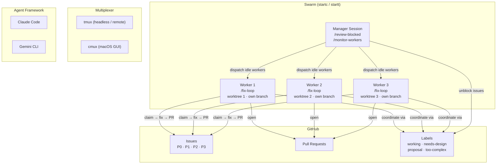

# Autocoder Plugin (Claude Code)

Autonomous GitHub issue resolution system with infinite loop support.

## ⚠️ Compatibility Notice

**This plugin is primarily developed for personal use.** While it should work on Linux, macOS, and WSL (Windows Subsystem for Linux), there are no guarantees it will work in all environments. Use at your own risk.

**Tested Platforms:**
- ✅ Linux
- ✅ macOS
- ✅ WSL (Windows Subsystem for Linux)
- ❌ Windows (native) - Not supported

## Installation

```bash
# Add the plugin marketplace (one-time setup)
/plugin add-registry https://github.com/laird/agents

# Install the autocoder plugin
/plugin install autocoder

# Run the installer (installs stop hook + parallel scripts)
/install
```

The `/install` command will:
1. Install stop hook for `/fix-loop` (project-local)
2. Install `start-parallel` and `join-parallel` scripts (global)
3. Optionally create shell aliases: `start` and `join`

Each step is explained clearly and requires your approval before making changes.

## Updating

If you cloned this repository and want to sync the installed plugin with the latest changes:

```bash
# From anywhere
bash ~/src/agents/scripts/update-plugin.sh

# Or from the repo
bash scripts/update-plugin.sh
```

The script auto-detects the repository location and updates:
- Commands (13 files)
- Scripts (7 files)
- Hooks (1 file)
- plugin.json (version info)

Alternatively, update via Claude Code (if available):
```bash
/plugin update autocoder
```

## Required Labels

The plugin automatically creates these labels on first run:

### Priority Labels

| Label | Color | Purpose |
|-------|-------|---------|
| `P0` | Red | Critical - system down, security, data loss |
| `P1` | Orange-Red | High - major feature broken, no workaround |
| `P2` | Orange | Medium - feature degraded, workaround exists |
| `P3` | Green | Low - minor issue, cosmetic |

### Status Labels

| Label | Color | Purpose |
|-------|-------|---------|
| `bug` | Red | Something isn't working |
| `enhancement` | Cyan | New feature or request |
| `proposal` | Light Purple | AI-generated, awaiting human approval |
| `test-failure` | Light Red | Regression test failure |
| `needs-review` | Yellow | Requires human review |
| `in-progress` | Green | Currently being worked on |
| `working` | Blue | **Concurrency lock** - issue claimed by an agent |

### Blocking Labels

These labels indicate why fix-loop cannot autonomously work on an issue:

| Label | Color | When Applied | Example |
|-------|-------|--------------|---------|
| `needs-approval` | `e99695` (red) | Architectural decisions, major changes, security implications | "Should we migrate from REST to GraphQL?" |
| `needs-design` | `fbca04` (yellow) | Requirements unclear, multiple valid approaches, needs design phase | "Add user dashboard" (what features? layout?) |
| `needs-clarification` | `d4c5f9` (purple) | Incomplete information, missing context, questions needed | "Fix the bug in checkout" (which bug? what's failing?) |
| `too-complex` | `b60205` (dark red) | Beyond autonomous capability, requires deep expertise/judgment | "Refactor entire auth system for multi-tenancy" |

**Note**: Blocking labels are independent from priority labels. An issue can have both `P0` + `needs-design`, meaning it's critical but needs design work before implementation.

## Workflow Priority

1. **Triage** - Assign P0-P3 to any unprioritized issues first
2. **Bugs** - Fix P0 → P1 → P2 → P3 issues
3. **Regression Tests** - Run tests, create issues for failures
4. **Approved Enhancements** - Implement enhancements without `proposal` label
5. **Proposals** - Keep generating proposals until nothing useful to propose
6. **Idle Sleep** - Sleep 60 min (configurable), then check for new work

Proposals are tagged with `proposal` label and never auto-implemented. When a human removes the label, the workflow will implement it.

## Parallel Agent Support

The `working` label provides concurrency control when multiple agents run in parallel:

### How It Works

1. **Claim**: When an agent starts work on an issue, it adds the `working` label
2. **Filter**: All issue queries exclude issues with the `working` label
3. **Release**: When work completes (success, skip, or failure), the label is removed

### Benefits

- **No duplicate work**: Multiple agents won't pick up the same issue
- **Visible status**: GitHub UI shows which issues are actively being worked on
- **Automatic cleanup**: Label is removed on completion, skip, or when an issue is closed

### Manual Override

If an agent crashes or disconnects without releasing the lock:

```bash
# Remove the working label manually
gh issue edit <issue_number> --remove-label "working"
```

### Example: Running Multiple Agents

```bash
# Terminal 1: Start first agent
/fix-loop

# Terminal 2: Start second agent (different working directory or repo clone)
/fix-loop

# Both agents will work on different issues without conflict
```

## Blocked Issue Review Workflow

When fix-loop encounters issues it cannot handle autonomously, it adds blocking labels (`needs-approval`, `needs-design`, `needs-clarification`, `too-complex`) and moves on. Use `/review-blocked` in a separate session to review and unblock these issues.

### Workflow

```bash
# Terminal 1: Run fix-loop continuously
/fix-loop

# Terminal 2: Review blocked issues interactively (in parallel)
/review-blocked
```

### Interactive Review Process

1. **Overview**: Shows summary of blocked issues by category and priority
   ```
   Found 5 blocked issues:
   - 3 needs-design (1 P0, 2 P1)
   - 2 needs-approval (1 P1, 1 P2)
   - 0 needs-clarification
   - 0 too-complex
   ```

2. **Highest Priority First**: Proposes the highest priority blocked issue
   ```
   Start with P0 needs-design issue #123: Add user authentication system?
   ```

3. **Analysis & Recommendations**: Presents 2-3 approaches with pros/cons
   ```markdown
   ### Recommended Approaches

   **Option A: OAuth 2.0 with JWT** (Recommended)
   - Pros: Industry standard, scalable, supports SSO
   - Cons: More complex initial setup
   - Effort: Medium

   **Option B: Session-based auth**
   - Pros: Simpler, well-understood
   - Cons: Harder to scale, no SSO support
   - Effort: Small
   ```

4. **Decision**: Choose how to proceed
   - **Approve** → Removes blocking label, fix-loop will implement on next iteration
   - **Explore further** → Use `/brainstorm`, `/q1-hypothesize`, or ask questions
   - **Reject** → Closes issue with reason
   - **Skip** → Leaves blocked, moves to next issue

### Command Options

```bash
/review-blocked                     # Review all blocked issues
/review-blocked --label needs-design    # Filter to specific blocking label
/review-blocked --priority P0       # Filter to specific priority
/review-blocked 123                 # Jump directly to issue #123
```

### Benefits

- **Non-blocking**: Runs in separate session, doesn't interrupt fix-loop
- **Priority-driven**: Always surfaces most important blocked issues first
- **Lightweight**: Quick recommendations, dive deeper with other skills if needed
- **Clear transitions**: Issues move from blocked → approved with proper labels

## Commands

| Command | Description |
|---------|-------------|
| `/fix [number]` | Fix a specific issue or highest priority GitHub issue |
| `/fix-loop` | Start infinite loop that runs `/fix` continuously |
| `/stop-loop` | Stop the continuous fix loop |
| `/monitor-workers` | Monitor worker agents, dispatch idle workers, detect stale locks, deploy when done |
| `/review-blocked` | Interactive review of blocked issues (run in parallel with fix-loop) |
| `/list-proposals` | List pending enhancement proposals |
| `/approve-proposal <number>` | Approve a proposal for implementation |
| `/list-needs-design` | List issues requiring design/architecture work |
| `/list-needs-feedback` | List issues requiring human feedback |
| `/brainstorm-issue [number]` | Brainstorm design for an issue |
| `/full-regression-test` | Run complete test suite and create issues for failures |
| `/improve-test-coverage` | Analyze and improve test coverage |
| `/install` | Install stop hook, parallel agent scripts, shell aliases, and check dependencies |
| `/autocoder-help` | Show help and workflow overview |

## Monitor Workers (`/monitor-workers`)

The `/monitor-workers` command is the manager's primary tool for overseeing a swarm of parallel agents. Run it in the **manager session** (main project directory, not a worktree).

### What It Does

1. **Check worktree status** — For each worker worktree, reports branch, last commit time, and whether actively working
2. **Read worker screens** — Uses cmux/tmux to check if agents are idle or active
3. **Detect stale "working" labels** — Finds issues tagged "working" with no agent activity in the last hour; asks to remove
4. **Find unblocked issues** — Lists open issues without blocking labels
5. **Dispatch idle workers** — Sends `/autocoder:fix <issue_number>` to idle workers via cmux/tmux
6. **Deploy when ready** — When all workers complete all unblocked issues and integration has new commits, deploys

### Usage

```bash
# One-shot status check
/monitor-workers

# Continuous monitoring until all work complete
/monitor-workers --watch
```

### How Dispatching Works

**cmux** (reads screens and sends keystrokes):
```bash
cmux read-screen --workspace <ref> --lines 15    # Check if idle
cmux send --workspace <ref> "/autocoder:fix 123"  # Dispatch work
cmux send-key --workspace <ref> Enter              # Execute
```

**tmux** (same capability):
```bash
tmux capture-pane -t <session>:<window>.<pane> -p | tail -15  # Check
tmux send-keys -t <session>:<window>.<pane> "/autocoder:fix 123" Enter
```

### Stale Lock Detection

Detects when a "working" label is stale (agent crashed or disconnected):
- No commits or file changes for the issue in the last hour
- No agent process found working on it
- Asks you before removing the label so another worker can pick it up

## Running the Swarm

The autocoder plugin supports running a **swarm** of parallel AI agents — multiple workers fixing issues simultaneously, coordinated by a manager session that reviews blocked issues, monitors progress, and deploys completed work.

### Architecture



### Quick Start

```bash
# 1. Install (one-time, inside Claude Code)
/install

# 2. Start the swarm (from terminal, in your project)
cd ~/src/myproject

# Using cmux (native macOS GUI)
startc 3                # 3 workers + 1 manager

# Using tmux (headless terminal multiplexer)
startt 3                # 3 workers + 1 manager
```

### End-to-End Walkthrough

Here's the full narrative of running a swarm. You work primarily through the **manager session** — the workers run autonomously in the background. You only need to visit individual worker sessions to provide oversight or troubleshoot issues.

**Step 1: Install (one-time, inside Claude Code)**

```bash
/install
```

Run this first. The installer:
- Checks dependencies (tmux/cmux, claude/gemini, gh) and suggests how to install anything missing
- Installs the stop hook for `/fix-loop`
- Creates terminal commands (`start-parallel`, `join-parallel`, `end-parallel`, `stop-parallel`)
- Sets up shell aliases (`startt`/`startc`, `joint`/`joinc`, `endt`/`endc`, `stopt`/`stopc`)

After install, restart your shell to pick up the new aliases.

**Step 2: Start the swarm (from your terminal)**

```bash
cd ~/src/myproject
startc 3                # cmux (macOS GUI): 3 workers + 1 manager
# or: startt 3          # tmux (headless): 3 workers + 1 manager
```

This creates 3 git worktrees (`myproject-wt-1`, `myproject-wt-2`, `myproject-wt-3`) as sibling directories, each on its own branch. It launches an agent in each worktree running `/fix-loop`, plus opens a **manager session** in the main project directory. The manager session is where you'll spend your time.

**Step 3: Work from the manager session**

The workers run autonomously — each picks the highest-priority unblocked issue, claims it with a `working` label (so other workers skip it), creates a branch, implements the fix, runs tests, and opens a PR. When done, it picks the next issue. If it encounters something it can't handle, it adds a blocking label (`needs-design`, `too-complex`, etc.) and moves on.

Your job in the manager session is to keep the workers unblocked and productive:

```bash
# Review issues that workers couldn't handle autonomously
/review-blocked
```

This shows a summary of blocked issues by category and priority. For each one, it presents analysis and 2-3 recommended approaches. You can:
- **Approve** — removes the blocking label so a worker picks it up on its next iteration
- **Reject** — closes the issue with an explanation
- **Explore further** — brainstorm, ask questions, dig deeper
- **Skip** — leave it blocked for now, move to the next one

```bash
# Check on worker status, dispatch idle agents, deploy when ready
/monitor-workers
```

This reads each worker's screen via cmux/tmux, reports their status (active, idle, or stalled), detects stale `working` labels from crashed agents, and dispatches idle workers to unblocked issues. When all workers have finished all available work, it can auto-deploy.

You can also review proposals and approve them for workers to implement:

```bash
/list-proposals          # See AI-generated enhancement proposals
/approve-proposal 67     # Approve one for a worker to implement
```

**Step 4: (Optional) Visit worker sessions for oversight**

You don't normally need to interact with individual workers, but you can switch to their sessions to watch them work or troubleshoot:
- **cmux**: Click the worker tab (e.g., `wt1-myproject`)
- **tmux**: `Ctrl+b` then `0` to switch to the workers window

**Step 5: Rejoin later if you step away**

```bash
joinc                   # cmux: shows workspace list
# or: joint             # tmux: reattaches to session
```

**Step 6: Tear down when done**

```bash
endc                    # cmux: end session + clean up worktrees
# or: endt              # tmux: end session + clean up worktrees
# Add --keep-worktrees to preserve worktree directories
```

### Manager Session Commands

The manager session is your control center. Use these commands:

| Command | Purpose |
|---------|---------|
| `/review-blocked` | Review issues that workers can't handle autonomously (needs-design, too-complex, proposal, etc.). Approve, reject, or skip each one. |
| `/monitor-workers` | Check worker status, detect stale locks, dispatch work to idle workers via cmux/tmux, deploy when all work completes. |
| `/list-proposals` | Review AI-generated enhancement proposals. |
| `/approve-proposal N` | Approve a proposal so workers can implement it. |

### Worker Coordination

Workers coordinate automatically via GitHub labels:
- **`working` label**: Concurrency lock — when a worker starts an issue, it adds this label. Other workers skip issues with this label.
- **Priority order**: Workers pick the highest priority unblocked issue (P0 > P1 > P2 > P3).
- **Idle sleep**: When no work is available, workers sleep and periodically check for new issues.

### Manager Dispatching via cmux/tmux

The `/monitor-workers` command can **send commands directly** to idle worker sessions:

**cmux** (reads screens and sends keystrokes):
```bash
cmux read-screen --workspace <ref> --lines 15    # Check if idle
cmux send --workspace <ref> "/autocoder:fix 123"  # Dispatch work
cmux send-key --workspace <ref> Enter              # Execute
```

**tmux** (same capability):
```bash
tmux capture-pane -t <session>:<window>.<pane> -p | tail -15  # Check
tmux send-keys -t <session>:<window>.<pane> "/autocoder:fix 123" Enter
```

This means the manager can detect idle workers and assign them new issues without you switching terminals.

### Stale Lock Detection

`/monitor-workers` detects when a "working" label is stale (agent crashed or disconnected):
- No commits or file changes for the issue in the last hour
- No agent process found working on it
- Asks you before removing the label so another worker can pick it up

## Parallel Agent System

Run multiple AI agents in parallel using tmux or cmux and git worktrees for coordinated autonomous work. Supports both Claude Code and Gemini CLI as agent frameworks.

### Quick Start

```bash
# 1. Install autocoder components (one-time, inside Claude Code)
/install

# Approve when prompted:
# - Stop hook: Yes (for /fix-loop)
# - Parallel scripts: Yes (for terminal commands)
# - Shell aliases: Optional (shorter commands)

# 2. Start parallel agents (from terminal, in your project)
cd ~/src/myproject

# Using tmux (headless terminal multiplexer)
startt 3                # 3 workers + 1 review coordinator
# or: start-parallel-agents.sh --mux tmux 3

# Using cmux (native macOS GUI multiplexer)
startc 3                # 3 workers + 1 review coordinator
# or: start-parallel-agents.sh --mux cmux 3

# 3. Detach when done watching (tmux only)
# Ctrl+b then d

# 4. Rejoin anytime
joint                   # tmux
joinc                   # cmux
```

### Multiplexer Options

| Multiplexer | Type | Platform | Install |
|-------------|------|----------|---------|
| **tmux** | Headless terminal multiplexer | Linux, macOS | `brew install tmux` |
| **cmux** | Native macOS GUI app (Ghostty-based) | macOS only | `brew tap manaflow-ai/cmux && brew install --cask cmux` |

### Agent Framework Options

| Framework | Launch Command | Slash Commands |
|-----------|---------------|----------------|
| **Claude Code** | `claude code --dangerously-skip-permissions .` | `/autocoder:fix-loop`, `/autocoder:review-blocked` |
| **Gemini CLI** | `gemini --sandbox=false` | `/fix-loop`, `/review-blocked` |

Auto-detection prefers cmux over tmux, and Claude over Gemini. Override with `--mux` and `--agent` flags.

### How It Works

#### tmux Mode

Creates a tmux session with 2 windows:

**Window 0: Parallel Fix Agents**
- 3+ panes running `/fix-loop` simultaneously
- Each pane in its own git worktree (separate feature branch)
- All share task list via `CLAUDE_CODE_TASK_LIST_ID`
- Prevents duplicate work with `working` label

**Window 1: Review/Planning**
- 1 pane running `/review-blocked`
- Interactive review of issues needing human decisions
- Non-blocking to autonomous agents

#### cmux Mode

Creates one workspace (tab) per agent:

**Worker Workspaces** (named `wt1-<project>`, `wt2-<project>`, etc.)
- Each runs `/fix-loop` in its own git worktree
- Isolated feature branches for parallel work

**Manager Workspace** (named `<project>`)
- Runs `/review-blocked`
- Interactive review of issues needing human decisions

### Shell Aliases

After adding aliases to `~/.zshrc`:

| Alias | Purpose |
|-------|---------|
| `startt N` | Start N agents in tmux |
| `joint` | Rejoin tmux session |
| `stopt` | Kill tmux session |
| `startc N` | Start N agents in cmux |
| `joinc` | List/select cmux workspaces |
| `stopc` | Close cmux agent workspaces |

### Terminal Commands (start, join, end)

These are the three key commands for managing the parallel agent lifecycle:

| Command | Purpose | Usage |
|---------|---------|-------|
| `start-parallel-agents.sh` | **Start** parallel agent system | `[num_agents] [--mux tmux\|cmux] [--agent claude\|gemini] [--no-worktrees]` |
| `join-parallel-agents.sh` | **Join** (rejoin) existing session | `[--mux tmux\|cmux] [session_name]` |
| `end-parallel-agents.sh` | **End** session and clean up worktrees | `[session_name] [--keep-worktrees]` |
| `stop-parallel-agents.sh` | **Stop** all agent sessions (no cleanup) | `[--mux tmux\|cmux]` |

**Start** creates worktrees, launches agents, and opens the manager session. **Join** reconnects to an existing session. **End** tears down the session and optionally removes worktrees. **Stop** kills sessions without worktree cleanup.

**Shell aliases** (installed by `/install`):

| Alias | Full Command | Description |
|-------|-------------|-------------|
| `startt N` | `start-parallel-agents.sh --mux tmux N` | Start N agents in tmux |
| `joint` | `join-parallel-agents.sh --mux tmux` | Rejoin tmux session |
| `stopt` | `stop-parallel-agents.sh --mux tmux` | Kill tmux session |
| `endt` | `end-parallel-agents.sh` | End tmux session + cleanup |
| `startc N` | `start-parallel-agents.sh --mux cmux N` | Start N agents in cmux |
| `joinc` | `join-parallel-agents.sh --mux cmux` | List/select cmux workspaces |
| `stopc` | `stop-parallel-agents.sh --mux cmux` | Close cmux agent workspaces |
| `endc` | `end-parallel-agents.sh` | End cmux session + cleanup |

**Examples:**
```bash
# Starting with explicit options
start-parallel-agents.sh 3 --mux tmux --agent claude
start-parallel-agents.sh 4 --mux cmux --agent gemini
start-parallel-agents.sh 3 --no-worktrees

# Joining
joint                           # tmux: auto-detect session
joinc                           # cmux: list workspaces

# Ending (tears down session + cleans worktrees)
endt                            # tmux: end session for current project
endc                            # cmux: end session for current project
endt --keep-worktrees           # End session but keep worktrees

# Stopping (kills session only, no worktree cleanup)
stopt                           # tmux: kill session for current project
stopc                           # cmux: close all agent workspaces for current project
```

### Git Worktrees

For each worker agent:
- **Worktree path**: `<project>-wt-1`, `<project>-wt-2`, etc. (sibling directories)
- **Branch**: `<current-branch>-wt-1`, `<current-branch>-wt-2`, etc.
- **Isolation**: Each agent works on independent branch without conflicts
- **Integration**: Main agent merges completed work when deploying

**Note**: Use `--no-worktrees` to run all agents in same directory (no git operations).

### Session Management

**tmux session naming**: `<agent>-<project-name>` (e.g. `claude-myproject`)

**tmux workflow:**
- Stop session: `stopt` (kills tmux session)
- Detach temporarily: `Ctrl+b` then `d` (session keeps running)
- Switch windows: `Ctrl+b` then `0` or `1`
- Manual kill: `tmux kill-session -t claude-<project-name>`

**cmux workspace naming**: `wt<N>-<project>` (workers), `<project>` (manager)

**cmux workflow:**
- Stop workspaces: `stopc` (closes all agent workspaces for current project)
- List workspaces: `cmux list-workspaces`
- Read screen: `cmux read-screen --workspace <ref>`
- Send command: `cmux send --workspace <ref> "text"` + `cmux send-key --workspace <ref> enter`

### Benefits

- **Parallel work**: Multiple agents tackle independent issues simultaneously
- **Zero conflicts**: Git worktrees provide isolation
- **Coordinated**: Shared task list prevents duplicate work
- **Non-blocking review**: Handle blocked issues without interrupting agents
- **Automatic deployment**: Coordinator merges and deploys when ready
- **Flexible**: Choose tmux (headless/remote) or cmux (native macOS GUI)

### Example Workflow

```bash
# Terminal: Start the system with cmux
cd ~/src/myproject
startc 3

# [cmux shows 4 workspaces/tabs:]
# - wt1-myproject: Agent fixing P0 issue #45
# - wt2-myproject: Agent fixing P1 issue #67
# - wt3-myproject: Agent running regression tests
# - myproject: Review coordinator handling blocked issues

# Later: Check on progress
joinc

# Done: Tear down all agent workspaces
stopc
```

## Utility Scripts

The plugin includes utility scripts in `scripts/` directory for automating common tasks:

### Parallel Agent Management

| Script | Purpose | Usage |
|--------|---------|-------|
| `start-parallel-agents.sh` | Launch multi-agent session (tmux/cmux) | `start-parallel-agents.sh [num_agents] [--mux tmux\|cmux] [--agent claude\|gemini]` |
| `join-parallel-agents.sh` | Rejoin existing session (tmux/cmux) | `join-parallel-agents.sh [--mux tmux\|cmux] [session_name]` |
| `end-parallel-agents.sh` | End session and clean up worktrees | `end-parallel-agents.sh [session_name] [--keep-worktrees]` |
| `stop-parallel-agents.sh` | Stop all agent sessions (tmux/cmux) | `stop-parallel-agents.sh [--mux tmux\|cmux]` |

### Blocked Issue Management

| Script | Purpose | Usage |
|--------|---------|-------|
| `fetch-blocked-issues.sh` | Fetch and filter blocked issues | `bash ~/.claude/plugins/autocoder/scripts/fetch-blocked-issues.sh [--label LABEL] [--priority PRIORITY] [ISSUE_NUM]` |
| `add-blocking-label.sh` | Add blocking label with explanation | `bash ~/.claude/plugins/autocoder/scripts/add-blocking-label.sh <issue_num> <label> <reason>` |
| `approve-blocked-issue.sh` | Approve and unblock an issue | `bash ~/.claude/plugins/autocoder/scripts/approve-blocked-issue.sh <issue_num> <label> <approach>` |
| `reject-blocked-issue.sh` | Reject and close a blocked issue | `bash ~/.claude/plugins/autocoder/scripts/reject-blocked-issue.sh <issue_num> <reason>` |

### Testing

| Script | Purpose | Usage |
|--------|---------|-------|
| `regression-test.sh` | Run comprehensive regression tests | `bash ~/.claude/plugins/autocoder/scripts/regression-test.sh` |

### Script Features

- **Portable**: Work across different plugin installations and environments
- **Standalone**: Can be run directly from command line for automation
- **Idempotent**: Safe to run multiple times (creates labels if missing)
- **Standards-based**: Uses GitHub CLI (`gh`) for all GitHub operations

### Example: Manual Workflow

```bash
# Fetch all needs-design issues
bash ~/.claude/plugins/autocoder/scripts/fetch-blocked-issues.sh --label needs-design | jq

# Approve an issue after manual review
bash ~/.claude/plugins/autocoder/scripts/approve-blocked-issue.sh 123 "needs-design" "Option A: OAuth 2.0"

# Add blocking label to an issue
bash ~/.claude/plugins/autocoder/scripts/add-blocking-label.sh 456 "needs-approval" "Breaking API change requires approval"
```

These scripts are called by the commands but can also be used independently for custom workflows or CI/CD integration.

## Infinite Loop Setup

The `/fix-loop` command uses Claude Code's stop hook mechanism to run forever.

### How It Works

1. Creates state file: `.claude/fix-loop.local.md`
2. Stop hook intercepts session exit
3. If state file exists, feeds `/fix` back as input
4. Loop continues until manually stopped

### Usage

```bash
# Start infinite loop
/fix-loop

# Limit to 100 iterations
/fix-loop 100

# Custom idle sleep time (default 60 min)
/fix-loop --sleep 120
```

### Stopping the Loop

1. **Ctrl+C** - Manual interrupt
2. **Output `STOP_FIX_GITHUB_LOOP`** - Explicit stop signal
3. **Max iterations** - If configured, stops when reached
4. **Delete state file** - `rm .claude/fix-loop.local.md`
5. **Critical errors** - Auto-pauses on auth/rate limit issues

### Idle Behavior

When no work is available (no bugs, no approved enhancements, nothing useful to propose), the loop sleeps for 60 minutes (configurable with `--sleep`) then wakes to check for:
- New human-created issues
- Comments on existing issues
- Approved proposals (human removed `proposal` label)

### State File

The loop state is stored in `.claude/fix-loop.local.md`:

```markdown
---
iteration: 5
max_iterations: 0
idle_sleep_minutes: 60
started: 2024-01-15T10:30:00-05:00
---

/fix
```

The `.local.md` suffix ensures it's gitignored.

## Comparison with Watchdog Script

| Feature | Stop Hook | Watchdog Script |
|---------|-----------|-----------------|
| Runs inside Claude | Yes | External |
| Maintains context | Yes | Fresh start |
| Configurable limits | Yes | No |
| Smart stop signals | Yes | No |
| Error recovery | Pauses | Restarts |
| Requires external process | No | Yes |

The stop hook approach is more reliable because:
- Claude maintains conversation context across iterations
- No gap between exit and restart
- Smart detection of when to pause (proposals, errors)
- Can set iteration limits
