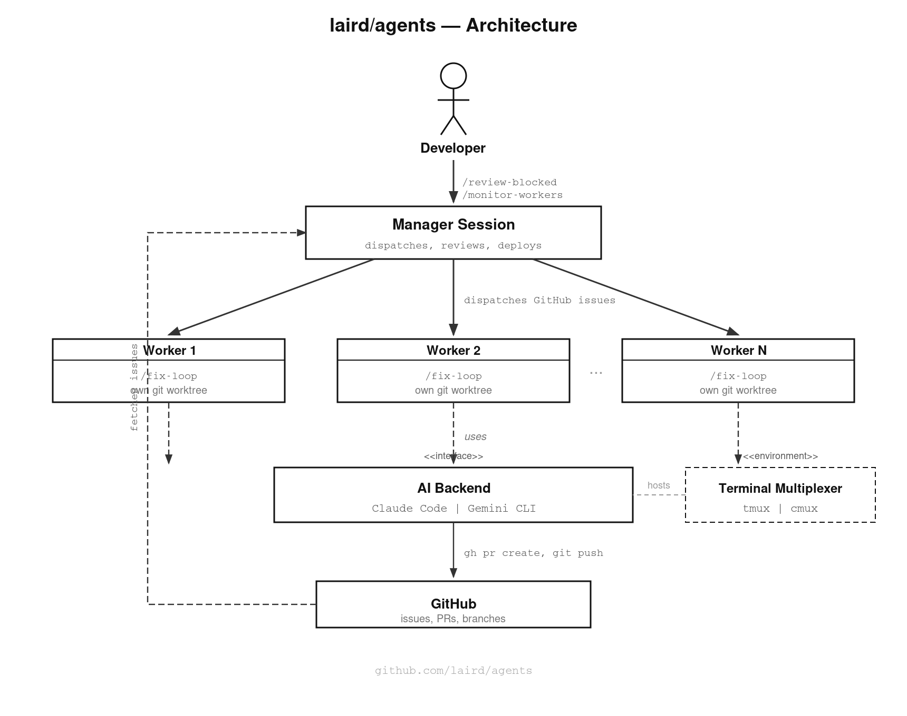

# Autocoder Plugin (Claude Code)

Autonomous GitHub issue resolution system with infinite loop support.



## ⚠️ Compatibility Notice

**This plugin is primarily developed for personal use.** While it should work on Linux, macOS, and WSL (Windows Subsystem for Linux), there are no guarantees it will work in all environments. Use at your own risk.

**Tested Platforms:**
- ✅ Linux
- ✅ macOS
- ✅ WSL (Windows Subsystem for Linux)
- ❌ Windows (native) - Not supported

## Installation

```bash
# Add the plugin marketplace (one-time setup)
/plugin add-registry https://github.com/laird/agents

# Install the autocoder plugin
/plugin install autocoder

# Run the installer (installs stop hook + parallel scripts)
/install
```

The `/install` command will:
1. Install stop hook for `/fix-loop` (project-local)
2. Install `start-parallel`, `add-worker`, `remove-worker`, `join-parallel`, `end-parallel`, and `stop-parallel` scripts (global)
3. Check required dependencies and report any missing setup

Each step is explained clearly and requires your approval before making changes.

## Updating

If you cloned this repository and want to sync the installed plugin with the latest changes:

```bash
# From anywhere
bash ~/src/agents/scripts/update-plugin.sh

# Or from the repo
bash scripts/update-plugin.sh
```

The script auto-detects the repository location and updates:
- Commands (13 files)
- Scripts (7 files)
- Hooks (1 file)
- plugin.json (version info)

Alternatively, update via Claude Code (if available):
```bash
/plugin update autocoder
```

## Required Labels

The plugin automatically creates these labels on first run:

### Priority Labels

| Label | Color | Purpose |
|-------|-------|---------|
| `P0` | Red | Critical - system down, security, data loss |
| `P1` | Orange-Red | High - major feature broken, no workaround |
| `P2` | Orange | Medium - feature degraded, workaround exists |
| `P3` | Green | Low - minor issue, cosmetic |

### Status Labels

| Label | Color | Purpose |
|-------|-------|---------|
| `bug` | Red | Something isn't working |
| `enhancement` | Cyan | New feature or request |
| `proposal` | Light Purple | AI-generated, awaiting human approval |
| `test-failure` | Light Red | Regression test failure |
| `needs-review` | Yellow | Requires human review |
| `in-progress` | Green | Currently being worked on |
| `working` | Blue | **Concurrency lock** - issue claimed by an agent |

### Blocking Labels

These labels indicate why fix-loop cannot autonomously work on an issue:

| Label | Color | When Applied | Example |
|-------|-------|--------------|---------|
| `needs-approval` | `e99695` (red) | Architectural decisions, major changes, security implications | "Should we migrate from REST to GraphQL?" |
| `needs-design` | `fbca04` (yellow) | Requirements unclear, multiple valid approaches, needs design phase | "Add user dashboard" (what features? layout?) |
| `needs-clarification` | `d4c5f9` (purple) | Incomplete information, missing context, questions needed | "Fix the bug in checkout" (which bug? what's failing?) |
| `too-complex` | `b60205` (dark red) | Beyond autonomous capability, requires deep expertise/judgment | "Refactor entire auth system for multi-tenancy" |

**Note**: Blocking labels are independent from priority labels. An issue can have both `P0` + `needs-design`, meaning it's critical but needs design work before implementation.

## Workflow Priority

1. **Triage** - Assign P0-P3 to any unprioritized issues first
2. **Bugs** - Fix P0 → P1 → P2 → P3 issues
3. **Regression Tests** - Run tests, create issues for failures
4. **Approved Enhancements** - Implement enhancements without `proposal` label
5. **Proposals** - Keep generating proposals until nothing useful to propose
6. **Idle Sleep** - Sleep 60 min (configurable), then check for new work

Proposals are tagged with `proposal` label and never auto-implemented. When a human removes the label, the workflow will implement it.

## Parallel Agent Support

The `working` label provides concurrency control when multiple agents run in parallel:

### How It Works

1. **Claim**: When an agent starts work on an issue, it adds the `working` label
2. **Filter**: All issue queries exclude issues with the `working` label
3. **Release**: When work completes (success, skip, or failure), the label is removed

### Benefits

- **No duplicate work**: Multiple agents won't pick up the same issue
- **Visible status**: GitHub UI shows which issues are actively being worked on
- **Automatic cleanup**: Label is removed on completion, skip, or when an issue is closed

### Manual Override

If an agent crashes or disconnects without releasing the lock:

```bash
# Remove the working label manually
gh issue edit <issue_number> --remove-label "working"
```

### Example: Running Multiple Agents

```bash
# Terminal 1: Start first agent
/fix-loop

# Terminal 2: Start second agent (different working directory or repo clone)
/fix-loop

# Both agents will work on different issues without conflict
```

## Blocked Issue Review Workflow

When fix-loop encounters issues it cannot handle autonomously, it adds blocking labels (`needs-approval`, `needs-design`, `needs-clarification`, `too-complex`) and moves on. Use `/review-blocked` in a separate session to review and unblock these issues.

### Workflow

```bash
# Terminal 1: Run fix-loop continuously
/fix-loop

# Terminal 2: Review blocked issues interactively (in parallel)
/review-blocked
```

### Interactive Review Process

1. **Overview**: Shows summary of blocked issues by category and priority
   ```
   Found 5 blocked issues:
   - 3 needs-design (1 P0, 2 P1)
   - 2 needs-approval (1 P1, 1 P2)
   - 0 needs-clarification
   - 0 too-complex
   ```

2. **Highest Priority First**: Proposes the highest priority blocked issue
   ```
   Start with P0 needs-design issue #123: Add user authentication system?
   ```

3. **Analysis & Recommendations**: Presents 2-3 approaches with pros/cons
   ```markdown
   ### Recommended Approaches

   **Option A: OAuth 2.0 with JWT** (Recommended)
   - Pros: Industry standard, scalable, supports SSO
   - Cons: More complex initial setup
   - Effort: Medium

   **Option B: Session-based auth**
   - Pros: Simpler, well-understood
   - Cons: Harder to scale, no SSO support
   - Effort: Small
   ```

4. **Decision**: Choose how to proceed
   - **Approve** → Removes blocking label, fix-loop will implement on next iteration
   - **Explore further** → Use `/brainstorm`, `/q1-hypothesize`, or ask questions
   - **Reject** → Closes issue with reason
   - **Skip** → Leaves blocked, moves to next issue

### Command Options

```bash
/review-blocked                     # Review all blocked issues
/review-blocked --label needs-design    # Filter to specific blocking label
/review-blocked --priority P0       # Filter to specific priority
/review-blocked 123                 # Jump directly to issue #123
```

### Benefits

- **Non-blocking**: Runs in separate session, doesn't interrupt fix-loop
- **Priority-driven**: Always surfaces most important blocked issues first
- **Lightweight**: Quick recommendations, dive deeper with other skills if needed
- **Clear transitions**: Issues move from blocked → approved with proper labels

## Commands

| Command | Description |
|---------|-------------|
| `/fix [number]` | Fix a specific issue or highest priority GitHub issue |
| `/fix-loop` | Start infinite loop that runs `/fix` continuously |
| `/stop-loop` | Stop the continuous fix loop |
| `/full-regression-test` | Run complete test suite and create issues for failures; logs results to history |
| `/monitor-workers` | Monitor worker agents, dispatch idle workers, scale fleet with `add-worker`, detect stale locks, deploy when done |
| `/monitor-loop` | Start continuous monitor-workers loop (default manager session startup command) |
| `/review-blocked` | Interactive review of blocked issues (auto-triggered by monitor-workers when all issues blocked) |
| `/retro` | Analyze history log + git log + issue tracker; write `IMPROVEMENTS.md` with 3–5 workflow recommendations |
| `/list-proposals` | List pending enhancement proposals |
| `/approve-proposal <number>` | Approve a proposal for implementation |
| `/list-needs-design` | List issues requiring design/architecture work |
| `/list-needs-feedback` | List issues requiring human feedback |
| `/brainstorm-issue [number]` | Brainstorm design for an issue |
| `/improve-test-coverage` | Analyze and improve test coverage |
| `/install` | Install stop hook, parallel agent scripts, and check dependencies |
| `/autocoder-help` | Show help and workflow overview |
| `/autocoder:gate` | Slim default for `/loop` cron path — branches on `/tmp/autocoder-work.json` phase, delegates to `/autocoder:fix N` |
| `/autocoder:dispatch` | Opt-in Haiku-pinned alternative — runs triage cheaply, spawns Sonnet/Opus Task subagent for fix work |

## Token-Efficient Loop Commands

Phase 2 and Phase 3 of the fix-loop token-efficiency work added two new commands used by `/fix-loop` to keep cron-driven iterations cheap. See the design spec at `docs/specs/2026-05-21-fix-loop-token-efficiency-design.md` (§5.3 command split, §13.4 acceptance criteria, §7.1.1 Task `model=` override verification).

### `/autocoder:gate` (default after Phase 2)

The slim replacement for `/autocoder:fix` on the `/loop` cron path. It reads the work descriptor at `/tmp/autocoder-work.json` (written by `fix-loop-gate.sh`), branches on the `phase` field, and delegates to `/autocoder:fix N` for actual fix work. This avoids loading `fix.md`'s full ~75 KB skill body on every cron tick — `gate.md` is only ~2 KB. It is now the default command invoked by `/fix-loop`.

### `/autocoder:dispatch` (opt-in, model-split)

An alternative entry point with `model: haiku` pinned in its frontmatter. Use it to do model-split routing: Haiku runs the cheap triage step, then spawns a `Task` subagent with `model="sonnet"` (or `model="opus"` for P0 issues) to do the actual fix. Opt in by setting `LOOP_MODEL_SPLIT=1` when starting `/fix-loop`. See spec §7.1.1 for the verification that confirms Task's `model=` override actually switches models.

### Configuration

| Env var | Default | Purpose |
|---------|---------|---------|
| `LOOP_MODEL_SPLIT` | `0` | When `1`, `/fix-loop` invokes `/autocoder:dispatch` instead of `/autocoder:gate`. |
| `AUTOCODER_WORK_JSON` | `/tmp/autocoder-work.json` | Path to the work descriptor written by `fix-loop-gate.sh` and read by `/autocoder:gate`. |
| `IDLE_SLEEP_MINUTES` | `60` | Idle sleep between cron iterations when no work is available (also exposed as `/fix-loop --sleep N`). |

## Monitor Workers (`/monitor-workers`)

The `/monitor-workers` command is the manager's primary tool for overseeing a swarm of parallel agents. Run it in the **manager session** (main project directory, not a worktree).

### What It Does

1. **Check worktree status** — For each worker worktree, reports branch, last commit time, and whether actively working
2. **Read worker screens** — Uses cmux/tmux to check if agents are idle or active
3. **Detect stale "working" labels** — Finds issues tagged "working" with no agent activity in the last hour; asks to remove
4. **Find unblocked issues** — Lists open issues without blocking labels
5. **Dispatch idle workers** — Sends `/autocoder:fix <issue_number>` to idle workers via cmux/tmux
6. **Deploy when ready** — When all workers complete all unblocked issues and integration has new commits, deploys

### Usage

```bash
# One-shot status check
/monitor-workers

# Continuous monitoring until all work complete
/monitor-workers --watch
```

### How Dispatching Works

**cmux** (reads screens and sends keystrokes):
```bash
cmux read-screen --workspace <ref> --lines 15    # Check if idle
cmux send --workspace <ref> "/autocoder:fix 123"  # Dispatch work
cmux send-key --workspace <ref> Enter              # Execute
```

**tmux** (same capability):
```bash
tmux capture-pane -t <session>:<window>.<pane> -p | tail -15  # Check
tmux send-keys -t <session>:<window>.<pane> "/autocoder:fix 123" Enter
```

### Stale Lock Detection

Detects when a "working" label is stale (agent crashed or disconnected):
- No commits or file changes for the issue in the last hour
- No agent process found working on it
- Asks you before removing the label so another worker can pick it up

## Monitor Loop (`/monitor-loop`)

The `/monitor-loop` command runs `/monitor-workers` on a recurring interval. This is the **default startup command for the manager session** in a swarm — it keeps the manager actively overseeing workers without manual intervention.

### Usage

```bash
# Start with default 15-minute interval
/monitor-loop

# Custom interval (every 5 minutes)
/monitor-loop 5
```

### What It Does

Each iteration:
1. Checks worker status via cmux/tmux screen reading
2. Detects stale "working" labels (agent crashed or disconnected)
3. Dispatches idle workers to unblocked issues
4. Runs `/review-blocked` automatically when all remaining issues are blocked (needs human input)
5. Deploys when all work is complete

This means you can start the swarm, run `/monitor-loop` in the manager session, and it handles the ongoing coordination — dispatching work, detecting problems, and escalating to you only when human decisions are needed.

## Running the Swarm

The autocoder plugin supports running a **swarm** of parallel AI agents — multiple workers fixing issues simultaneously, coordinated by a manager session that reviews blocked issues, monitors progress, and deploys completed work.

### Architecture

See the [architecture diagram](#autocoder-plugin-claude-code) at the top of this README.

### Quick Start

```bash
# 1. Install (one-time, inside Claude Code)
/install

# 2. Start the swarm (from terminal, in your project)
cd ~/src/myproject

# 3 workers + 1 manager, using tmux
start-parallel 3 --mux tmux --agent claude

# Or use cmux
start-parallel 3 --mux cmux --agent claude

# Start a configured swarm without workers pulling issues yet
start-parallel 5 --mux tmux --agent codex --issue-source github --paused
```

### End-to-End Walkthrough

Here's the full narrative of running a swarm. You work primarily through the **manager session** — the workers run autonomously in the background. You only need to visit individual worker sessions to provide oversight or troubleshoot issues.

**Step 1: Install (one-time, inside Claude Code)**

```bash
/install
```

Run this first. The installer:
- Checks dependencies (tmux/cmux, claude/gemini, gh) and suggests how to install anything missing
- Installs the stop hook for `/fix-loop`
- Creates terminal commands (`start-parallel`, `add-worker`, `remove-worker`, `join-parallel`, `end-parallel`, `stop-parallel`)

After install, restart your shell so `start-parallel` is on your `PATH`.

**Step 2: Start the swarm (from your terminal)**

```bash
cd ~/src/myproject
start-parallel 3 --mux cmux --agent claude
# or: start-parallel 3 --mux tmux --agent claude
```

This creates 3 git worktrees (`myproject-wt-1`, `myproject-wt-2`, `myproject-wt-3`) as sibling directories, each on its own branch. It launches an agent in each worktree running `/fix-loop`, plus opens a **manager session** in the main project directory. The manager session is where you'll spend your time.

**Step 3: Work from the manager session**

The workers run autonomously — each picks the highest-priority unblocked issue, claims it with a `working` label (so other workers skip it), creates a branch, implements the fix, runs tests, and opens a PR. When done, it picks the next issue. If it encounters something it can't handle, it adds a blocking label (`needs-design`, `too-complex`, etc.) and moves on.

Your job in the manager session is to keep the workers unblocked and productive:

```bash
# Review issues that workers couldn't handle autonomously
/review-blocked
```

This shows a summary of blocked issues by category and priority. For each one, it presents analysis and 2-3 recommended approaches. You can:
- **Approve** — removes the blocking label so a worker picks it up on its next iteration
- **Reject** — closes the issue with an explanation
- **Explore further** — brainstorm, ask questions, dig deeper
- **Skip** — leave it blocked for now, move to the next one

```bash
# Start continuous monitoring (recommended — runs every 15 min)
/monitor-loop

# Or one-shot status check
/monitor-workers
```

`/monitor-loop` continuously monitors workers, dispatches idle agents, detects stale locks, and auto-triggers `/review-blocked` when all remaining issues need human input. It's the recommended way to run the manager session — you start it and it handles the ongoing coordination, escalating to you only when decisions are needed.

You can also review proposals and approve them for workers to implement:

```bash
/list-proposals          # See AI-generated enhancement proposals
/approve-proposal 67     # Approve one for a worker to implement
```

**Step 4: (Optional) Visit worker sessions for oversight**

You don't normally need to interact with individual workers, but you can switch to their sessions to watch them work or troubleshoot:
- **cmux**: Click the worker tab (e.g., `wt1-myproject`)
- **tmux**: `Ctrl+b` then `0` to switch to the workers window

**Step 5: Rejoin later if you step away**

```bash
join-parallel --mux cmux
# or: join-parallel --mux tmux claude-myproject
```

**Step 6: Tear down when done**

```bash
end-parallel claude-myproject
# Add --keep-worktrees to preserve worktree directories
```

### Manager Session Commands

The manager session is your control center. Use these commands:

| Command | Purpose |
|---------|---------|
| `/review-blocked` | Review issues that workers can't handle autonomously (needs-design, too-complex, proposal, etc.). Approve, reject, or skip each one. |
| `/monitor-workers` | Check worker status, detect stale locks, dispatch work to idle workers via cmux/tmux, scale fleet, deploy when all work completes. |
| `/list-proposals` | Review AI-generated enhancement proposals. |
| `/approve-proposal N` | Approve a proposal so workers can implement it. |
| `/retro` | After a batch of work, analyze history and produce `IMPROVEMENTS.md` with recommendations. |

You can also tell the manager agent directly to scale the fleet:

```
"add a worker"         → manager runs: add-worker
"add two workers"      → manager runs: add-worker 2
"remove worker 2"      → manager runs: remove-worker 2
"we need more workers" → manager runs: add-worker --agent claude
```

`add-worker` creates new git worktree capacity, adds pane/workspace targets to the existing session, and starts the added workers. This is the command the user can ask the manager to run when they want one or more more workers to begin taking tasks.

### Worker Coordination

Workers coordinate automatically via GitHub labels:
- **`working` label**: Concurrency lock — when a worker starts an issue, it adds this label. Other workers skip issues with this label.
- **Priority order**: Workers pick the highest priority unblocked issue (P0 > P1 > P2 > P3).
- **Idle sleep**: When no work is available, workers sleep and periodically check for new issues.

### Manager Dispatching via cmux/tmux

The `/monitor-workers` command can **send commands directly** to idle worker sessions:

**cmux** (reads screens and sends keystrokes):
```bash
cmux read-screen --workspace <ref> --lines 15    # Check if idle
cmux send --workspace <ref> "/autocoder:fix 123"  # Dispatch work
cmux send-key --workspace <ref> Enter              # Execute
```

**tmux** (same capability):
```bash
tmux capture-pane -t <session>:<window>.<pane> -p | tail -15  # Check
tmux send-keys -t <session>:<window>.<pane> "/autocoder:fix 123" Enter
```

This means the manager can detect idle workers and assign them new issues without you switching terminals.

### Stale Lock Detection

`/monitor-workers` detects when a "working" label is stale (agent crashed or disconnected):
- No commits or file changes for the issue in the last hour
- No agent process found working on it
- Asks you before removing the label so another worker can pick it up

## Parallel Agent System

Run multiple AI agents in parallel using tmux or cmux and git worktrees for coordinated autonomous work. Supports Claude Code, Gemini CLI, Codex CLI, and Droid.

### Quick Start

```bash
# 1. Install autocoder components (one-time, inside Claude Code)
/install

# Approve when prompted:
# - Stop hook: Yes (for /fix-loop)
# - Parallel scripts: Yes (for terminal commands)

# 2. Start parallel agents (from terminal, in your project)
cd ~/src/myproject

# Using tmux (headless terminal multiplexer)
start-parallel 3 --mux tmux --agent claude

# Using cmux (native macOS GUI multiplexer)
start-parallel 3 --mux cmux --agent claude

# 3. Detach when done watching (tmux only)
# Ctrl+b then d

# 4. Rejoin anytime
join-parallel --mux tmux claude-myproject
join-parallel --mux cmux
```

### Multiplexer Options

| Multiplexer | Type | Platform | Install |
|-------------|------|----------|---------|
| **tmux** | Headless terminal multiplexer | Linux, macOS | `brew install tmux` |
| **cmux** | Native macOS GUI app (Ghostty-based) | macOS only | `brew tap manaflow-ai/cmux && brew install --cask cmux` |

### Agent Framework Options

| Framework | Launch Command | Slash Commands |
|-----------|---------------|----------------|
| **Claude Code** | `claude code --dangerously-skip-permissions .` | `/autocoder:fix-loop`, `/autocoder:review-blocked` |
| **Gemini CLI** | `gemini --sandbox=false` | `/fix-loop`, `/monitor-loop`, `/review-blocked` |
| **Codex CLI** | `codex` | Codex goal loop or shell-loop fallback |
| **Droid** | shell-loop wrapper | `scripts/droid-fix-loop.sh`, `scripts/droid-manage-workers-loop.sh` |

Auto-detection prefers cmux over tmux, and then checks available agents in order. Override with `--mux` and `--agent`.

### How It Works

#### tmux Mode

Creates a tmux session with 2 windows:

**Window 0: Parallel Fix Agents**
- 3+ panes running `/fix-loop` simultaneously
- Each pane in its own git worktree (separate feature branch)
- All share task list via `CLAUDE_CODE_TASK_LIST_ID`
- Prevents duplicate work with `working` label

**Window 1: Manager**
- 1 pane running `/monitor-loop`
- Monitors workers and dispatches new work
- Auto-triggers `/review-blocked` when human decisions are needed

#### cmux Mode

Creates one workspace (tab) per agent:

**Worker Workspaces** (named `wt1-<project>`, `wt2-<project>`, etc.)
- Each runs `/fix-loop` in its own git worktree
- Isolated feature branches for parallel work

**Manager Workspace** (named `<project>`)
- Runs `/monitor-loop`
- Monitors workers and surfaces blocked issues for review

### `start-parallel` Command

`start-parallel` is the primary command for launching a swarm.

```bash
start-parallel [num_workers] [options]
```

| Option | Values | Purpose |
|--------|--------|---------|
| `num_workers` | number | Worker count. Defaults to `3`. |
| `--mux` | `tmux`, `cmux` | Terminal multiplexer. Auto-detects when omitted. |
| `--agent` | `claude`, `gemini`, `codex`, `droid` | Agent framework. Auto-detects when omitted. |
| `--issue-source` | `file`, `github` | Issue backend for this swarm run. |
| `--issue-dir` | path | File issue directory when using `--issue-source file`. |
| `--paused`, `--no-start` | flag | Create the swarm but do not start workers pulling issues. |
| `--no-worktrees` | flag | Run workers in the current directory instead of separate git worktrees. |

When `--issue-source` is omitted, `start-parallel` uses the issue source configured for the project in `.autocoder.json`. This lets a project keep using the backend selected by `/autocoder:set-issue-source` without repeating flags on every launch.

Examples:

```bash
# Claude workers in tmux
start-parallel 3 --mux tmux --agent claude

# Gemini workers in cmux
start-parallel 4 --mux cmux --agent gemini

# Codex workers using GitHub Issues, created paused
start-parallel 5 --mux tmux --agent codex --issue-source github --paused

# Droid workers without git worktrees
start-parallel 3 --mux cmux --agent droid --no-worktrees
```

Paused swarms create the manager session and worker panes/workspaces, but do not start `/fix-loop` or the equivalent shell fallback. The manager pane prints readiness guidance so you can review issues first, then use `add-worker` to start an idle worker or add new running capacity later:

```bash
add-worker --agent codex
add-worker 2 --agent codex
```

### Terminal Commands

These are the key commands for managing the parallel agent lifecycle:

| Command | Purpose | Usage |
|---------|---------|-------|
| `start-parallel` | **Start** parallel agent system | `[num_workers] [--mux tmux\|cmux] [--agent claude\|gemini\|codex\|droid] [--issue-source file\|github] [--issue-dir PATH] [--paused] [--no-worktrees]` |
| `add-worker` | **Add and start** one or more workers | `[count] [--mux tmux\|cmux] [--agent claude\|gemini\|codex\|droid] [--no-worktrees]` |
| `remove-worker` | **Stop** one or more workers | `WORKER_NUMBER [WORKER_NUMBER ...] [--mux tmux\|cmux] [--agent claude\|gemini\|codex\|droid] [--remove-worktree]` |
| `join-parallel` | **Join** (rejoin) existing session | `[--mux tmux\|cmux] [session_name]` |
| `end-parallel` | **End** session and clean up worktrees | `[session_name] [--keep-worktrees]` |
| `stop-parallel` | **Stop** all agent sessions (no cleanup) | `[--mux tmux\|cmux]` |

**Start** creates worktrees, launches agents, and opens the manager session. With `--paused`, it opens the swarm without starting workers. **Add-worker** first starts existing idle workers, then adds and starts new worker capacity if needed. **Remove-worker** stops selected manifest-backed workers and keeps their worktrees unless `--remove-worktree` is passed. **Join** reconnects to an existing session. **End** tears down the session and optionally removes worktrees. **Stop** kills sessions without worktree cleanup.

**Examples:**
```bash
# Starting with explicit options
start-parallel 3 --mux tmux --agent claude
start-parallel 4 --mux cmux --agent gemini
start-parallel 3 --mux tmux --agent codex
start-parallel 3 --mux cmux --agent droid
start-parallel 3 --no-worktrees
start-parallel 5 --mux tmux --agent codex --issue-source github --paused
add-worker --agent codex
add-worker 2 --agent codex
remove-worker 2 --agent codex

# Joining
join-parallel --mux tmux claude-myproject
join-parallel --mux cmux

# Ending (tears down session + cleans worktrees)
end-parallel claude-myproject
end-parallel claude-myproject --keep-worktrees

# Stopping (kills session only, no worktree cleanup)
stop-parallel --mux tmux
stop-parallel --mux cmux
```

### Git Worktrees

For each worker agent:
- **Worktree path**: `<project>-wt-1`, `<project>-wt-2`, etc. (sibling directories)
- **Branch**: `<current-branch>-wt-1`, `<current-branch>-wt-2`, etc.
- **Isolation**: Each agent works on independent branch without conflicts
- **Integration**: Main agent merges completed work when deploying

**Note**: Use `--no-worktrees` to run all agents in same directory (no git operations).

### Session Management

**tmux session naming**: `<agent>-<project-name>` (e.g. `claude-myproject`)

**tmux workflow:**
- Stop session: `stop-parallel --mux tmux` (kills tmux session)
- Detach temporarily: `Ctrl+b` then `d` (session keeps running)
- Switch windows: `Ctrl+b` then `0` or `1`
- Manual kill: `tmux kill-session -t claude-<project-name>`

**cmux workspace naming**: `wt<N>-<project>` (workers), `manager-<project>` (manager)

**cmux workflow:**
- Stop workspaces: `stop-parallel --mux cmux` (closes all agent workspaces for current project)
- List workspaces: `cmux list-workspaces`
- Read screen: `cmux read-screen --workspace <ref>`
- Send command: `cmux send --workspace <ref> "text"` + `cmux send-key --workspace <ref> enter`

### Benefits

- **Parallel work**: Multiple agents tackle independent issues simultaneously
- **Zero conflicts**: Git worktrees provide isolation
- **Coordinated**: Shared task list prevents duplicate work
- **Non-blocking review**: Handle blocked issues without interrupting agents
- **Automatic deployment**: Coordinator merges and deploys when ready
- **Flexible**: Choose tmux (headless/remote) or cmux (native macOS GUI)

### Example Workflow

```bash
# Terminal: Start the system with cmux
cd ~/src/myproject
start-parallel 3 --mux cmux --agent claude

# [cmux shows 4 workspaces/tabs:]
# - wt1-myproject: Agent fixing P0 issue #45
# - wt2-myproject: Agent fixing P1 issue #67
# - wt3-myproject: Agent running regression tests
# - manager-myproject: Review manager handling blocked issues

# Later: Check on progress
join-parallel --mux cmux

# Done: Tear down all agent workspaces
stop-parallel --mux cmux
```

## Utility Scripts

The plugin includes utility scripts in `scripts/` directory for automating common tasks:

### Parallel Agent Management

| Script | Purpose | Usage |
|--------|---------|-------|
| `start-parallel` | Launch multi-agent session (tmux/cmux) | `start-parallel [num_workers] [--mux tmux\|cmux] [--agent claude\|gemini\|codex\|droid] [--issue-source file\|github] [--issue-dir PATH] [--paused]` |
| `add-worker` | Add and start one or more workers | `add-worker [count] [--mux tmux\|cmux] [--agent claude\|gemini\|codex\|droid]` |
| `remove-worker` | Stop one or more workers | `remove-worker WORKER_NUMBER [WORKER_NUMBER ...] [--mux tmux\|cmux] [--agent claude\|gemini\|codex\|droid] [--remove-worktree]` |
| `join-parallel` | Rejoin existing session (tmux/cmux) | `join-parallel [--mux tmux\|cmux] [session_name]` |
| `end-parallel` | End session and clean up worktrees | `end-parallel [session_name] [--keep-worktrees]` |
| `stop-parallel` | Stop all agent sessions (tmux/cmux) | `stop-parallel [--mux tmux\|cmux]` |
| `append-to-history.sh` | Log an event to `HISTORY.md` or GitHub history-log issue | `append-to-history.sh [--backend file\|github\|auto] [--history-file PATH] TITLE WHAT WHY IMPACT` |

### Blocked Issue Management

| Script | Purpose | Usage |
|--------|---------|-------|
| `fetch-blocked-issues.sh` | Fetch and filter blocked issues | `bash ~/.claude/plugins/autocoder/scripts/fetch-blocked-issues.sh [--label LABEL] [--priority PRIORITY] [ISSUE_NUM]` |
| `add-blocking-label.sh` | Add blocking label with explanation | `bash ~/.claude/plugins/autocoder/scripts/add-blocking-label.sh <issue_num> <label> <reason>` |
| `approve-blocked-issue.sh` | Approve and unblock an issue | `bash ~/.claude/plugins/autocoder/scripts/approve-blocked-issue.sh <issue_num> <label> <approach>` |
| `reject-blocked-issue.sh` | Reject and close a blocked issue | `bash ~/.claude/plugins/autocoder/scripts/reject-blocked-issue.sh <issue_num> <reason>` |

### Testing

| Script | Purpose | Usage |
|--------|---------|-------|
| `regression-test.sh` | Run comprehensive regression tests | `bash ~/.claude/plugins/autocoder/scripts/regression-test.sh` |

### Script Features

- **Portable**: Work across different plugin installations and environments
- **Standalone**: Can be run directly from command line for automation
- **Idempotent**: Safe to run multiple times (creates labels if missing)
- **Standards-based**: Uses GitHub CLI (`gh`) for all GitHub operations

### Example: Manual Workflow

```bash
# Fetch all needs-design issues
bash ~/.claude/plugins/autocoder/scripts/fetch-blocked-issues.sh --label needs-design | jq

# Approve an issue after manual review
bash ~/.claude/plugins/autocoder/scripts/approve-blocked-issue.sh 123 "needs-design" "Option A: OAuth 2.0"

# Add blocking label to an issue
bash ~/.claude/plugins/autocoder/scripts/add-blocking-label.sh 456 "needs-approval" "Breaking API change requires approval"
```

These scripts are called by the commands but can also be used independently for custom workflows or CI/CD integration.

## History Logging and Retrospective

Autocoder agents record what they do so you can review their work over time and improve the workflow.

### What Gets Logged

Every time `/fix` resolves an issue, it appends a structured entry to the history log:

| Event | Entry |
|-------|-------|
| Issue fixed, auto-merged | `Fix #N: title` + branch + test result |
| Issue fixed, PR created | `PR #N: title` + awaiting review |
| Issue blocked | `Blocked #N: title` + label + reason |
| Regression test run | Pass/fail counts, new issues created |

### Where History Lives

**File backend** (`ISSUE_SOURCE=file`): `HISTORY.md` in your project root. In parallel-agent setups, all workers resolve to the main worktree's `HISTORY.md` automatically — no merge step needed.

**GitHub backend** (`ISSUE_SOURCE=github`): An issue labeled `history-log` is created on first use; each event becomes a comment. The issue is created automatically.

### `/retro` — Analyze and Improve

After running a batch of fixes, use `/retro` to produce evidence-backed improvement recommendations:

```bash
/retro                        # analyze last 12 months
/retro --since 2026-01-01     # scope to a date range
```

The command reads the history log, git log (reverts, corrections, multiple fix attempts), and issue tracker (blocking-label breakdown, proposal rates), then writes `IMPROVEMENTS.md` to your project root with 3–5 specific recommendations for improving the autocoder workflow.

**Recommended cadence**: run after every 20–30 issues. Review `IMPROVEMENTS.md`, apply approved changes to `plugins/autocoder/commands/` manually, then run `/retro` again to measure improvement.

### `append-to-history.sh`

The shared logging script (also used by the modernize plugin):

```bash
# File backend
append-to-history.sh --backend file --history-file HISTORY.md \
  "Fix #42: Auth timeout" \
  "Bumped token TTL in config.ts" \
  "Users logged out after 5 min" \
  "All tests passing. Merged to main."

# Auto-detect backend from $ISSUE_SOURCE
append-to-history.sh --backend auto --history-file HISTORY.md \
  "Blocked #67: Dashboard rewrite" \
  "Added label: needs-design" \
  "Multiple valid approaches, unclear which to use" \
  "Requires human review before proceeding."

# No flags = writes to docs/HISTORY.md (modernize backward compat)
append-to-history.sh "Title" "What" "Why" "Impact"
```

## Infinite Loop Setup

The `/fix-loop` command uses Claude Code's stop hook mechanism to run forever.

### How It Works

1. Creates state file: `.claude/fix-loop.local.md`
2. Stop hook intercepts session exit
3. If state file exists, feeds `/fix` back as input
4. Loop continues until manually stopped

### Usage

```bash
# Start infinite loop
/fix-loop

# Limit to 100 iterations
/fix-loop 100

# Custom idle sleep time (default 60 min)
/fix-loop --sleep 120
```

### Stopping the Loop

1. **Ctrl+C** - Manual interrupt
2. **Output `STOP_FIX_GITHUB_LOOP`** - Explicit stop signal
3. **Max iterations** - If configured, stops when reached
4. **Delete state file** - `rm .claude/fix-loop.local.md`
5. **Critical errors** - Auto-pauses on auth/rate limit issues

### Idle Behavior

When no work is available (no bugs, no approved enhancements, nothing useful to propose), the loop sleeps for 60 minutes (configurable with `--sleep`) then wakes to check for:
- New human-created issues
- Comments on existing issues
- Approved proposals (human removed `proposal` label)

### State File

The loop state is stored in `.claude/fix-loop.local.md`:

```markdown
---
iteration: 5
max_iterations: 0
idle_sleep_minutes: 60
started: 2024-01-15T10:30:00-05:00
---

/fix
```

The `.local.md` suffix ensures it's gitignored.

## Comparison with Watchdog Script

| Feature | Stop Hook | Watchdog Script |
|---------|-----------|-----------------|
| Runs inside Claude | Yes | External |
| Maintains context | Yes | Fresh start |
| Configurable limits | Yes | No |
| Smart stop signals | Yes | No |
| Error recovery | Pauses | Restarts |
| Requires external process | No | Yes |

The stop hook approach is more reliable because:
- Claude maintains conversation context across iterations
- No gap between exit and restart
- Smart detection of when to pause (proposals, errors)
- Can set iteration limits
